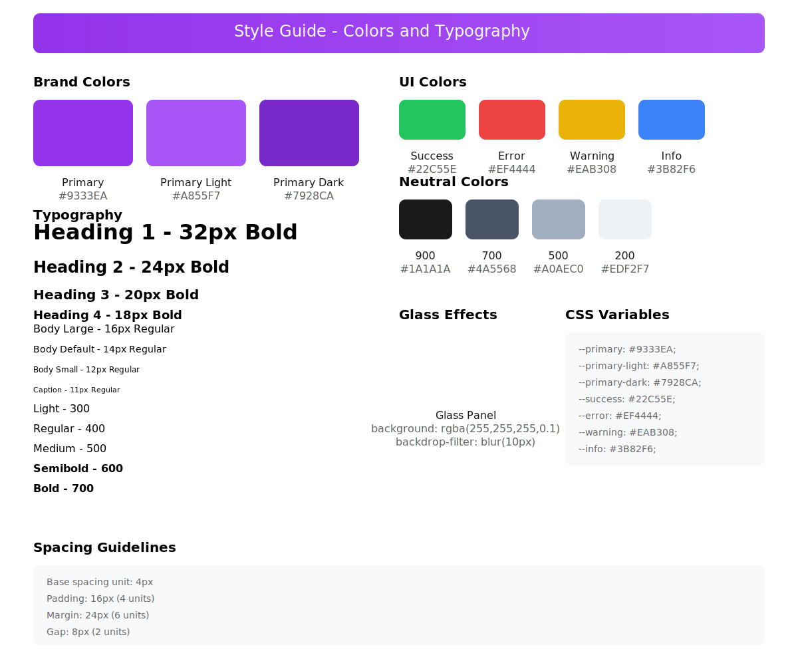

 - Styled components are named with the word Styled at the end
 - Component interfaces are named with the word Props at the end
 - All other Type interfaces are named with the word Type at the end
 - Always give the complete file without comments denoting missing code
 - Always use the style guides below for styling

