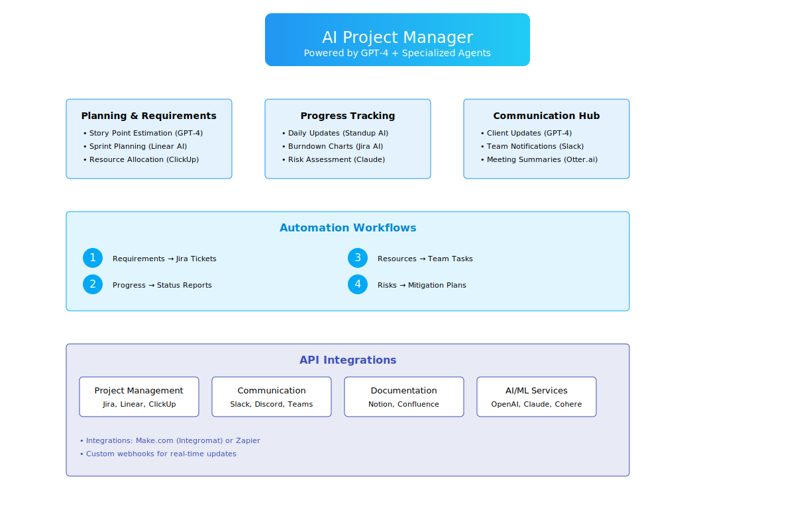

# Brian
## AI Project Manager

## Core Functions:
* Planning & Requirements
* Progress Tracking
* Communication Hub
* Automation Workflows:
* Requirements to tickets conversion
* Progress monitoring
* Resource optimization
* Risk detection
## API Integrations:
* Project Management tools
* Communication platforms
* Documentation systems
* AI/ML services
## Key Features:

* Color-coded sections
* Detailed workflow descriptions
* Integration specifications
* Tool recommendations for each function