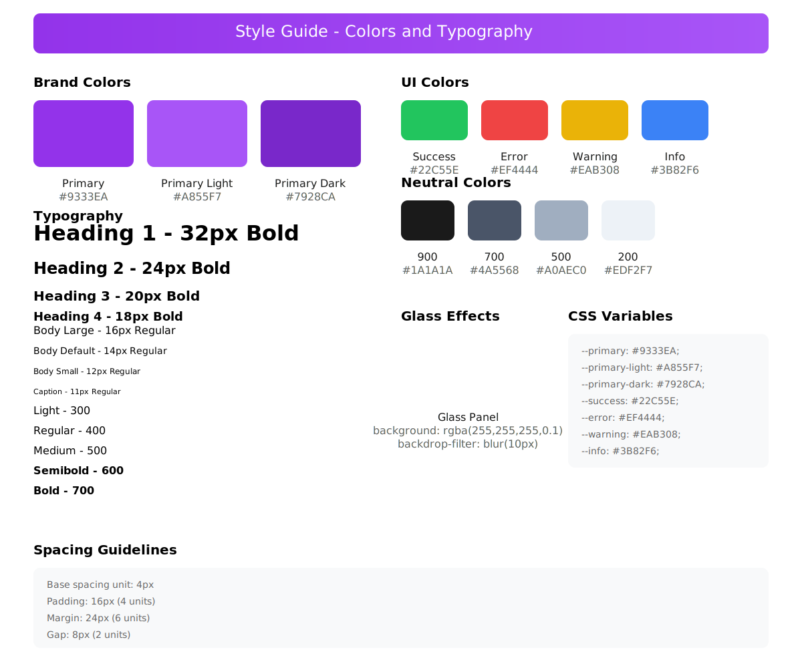
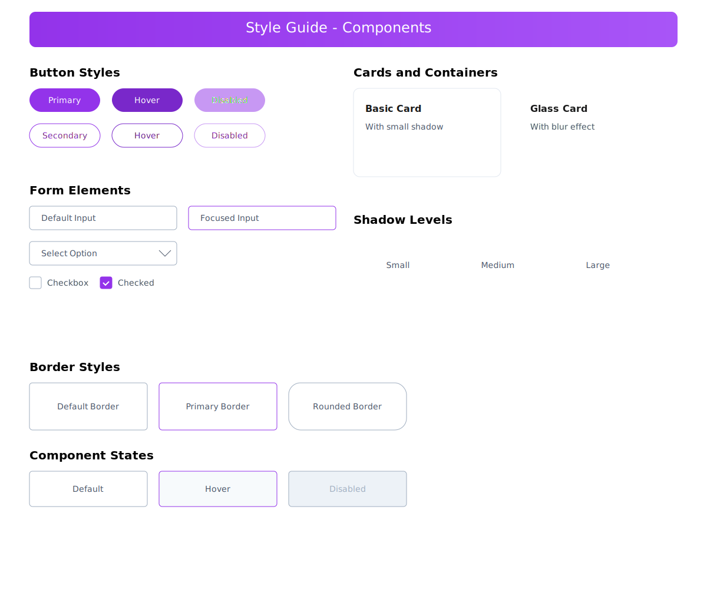
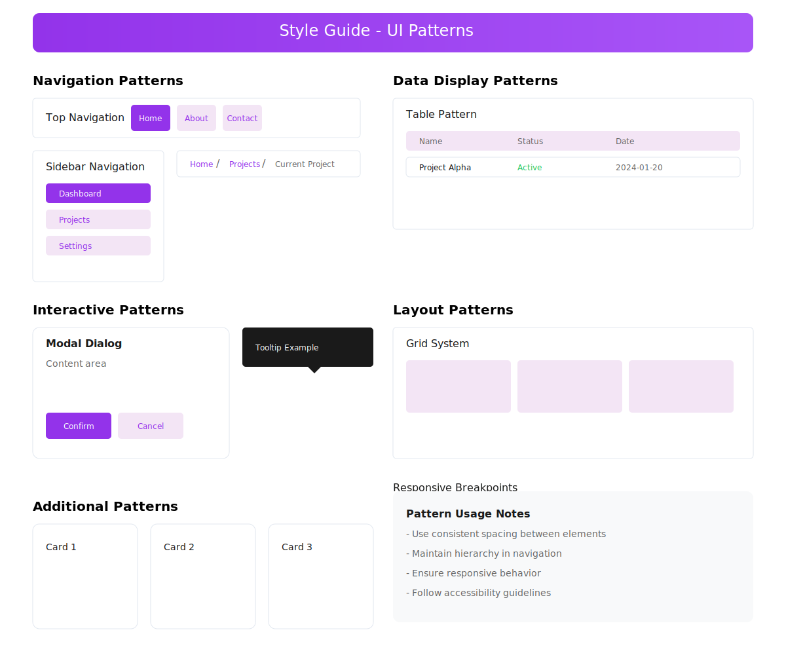
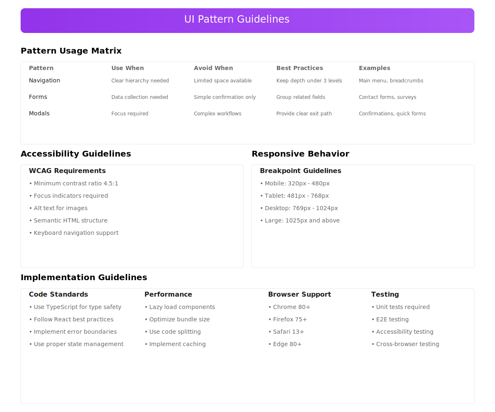

# [Agent Page Specific Style Guide](./agents-style-guide-README.md)

# Design System Style Guide

## Color Palette

### Brand Colors
- **Primary**: `#9333EA`
- **Primary Light**: `#A855F7`
- **Primary Dark**: `#7928CA`
- **Accent**: ["This should be the agent color that this widget falls under"]

### UI Colors
- **Success**: `#22C55E`
- **Error**: `#EF4444`
- **Warning**: `#EAB308`
- **Info**: `#3B82F6`

### Neutral Colors
- **900**: `#1A1A1A`
- **700**: `#4A5568`
- **500**: `#A0AEC0`
- **200**: `#EDF2F7`
- **100**: `#F8F9FA`

## Typography

- Do not use: Comic Sans!, Times New Roman, Inter, Arial 
- get a package of font face weights from 'next/font/google'  
- use consistent font hierarchy.

### Headings
- **H1**: 32px Bold
- **H2**: 24px Bold
- **H3**: 20px Bold
- **H4**: 18px Bold

### Body Text
- **Body Large**: 16px Regular
- **Body Default**: 14px Regular
- **Body Small**: 12px Regular
- **Caption**: 11px Regular

### Font Weights
- Light: 300
- Regular: 400
- Medium: 500
- Semibold: 600
- Bold: 700

## Spacing Guidelines
- **Base Unit**: 4px
- **Padding**: 16px (4 units)
- **Margin**: 24px (6 units)
- **Gap**: 8px (2 units)

## Components

### Buttons
1. **Primary Button**
   - Background: `#9333EA`
   - Hover: `#7928CA`
   - Disabled: 50% opacity
   
2. **Secondary Button**
   - Border: `#9333EA`
   - Text: `#9333EA`
   - Hover Border: `#7928CA`
   - Disabled: 50% opacity

### Form Elements
1. **Input Fields**
   - Default Border: `#A0AEC0`
   - Focus Border: `#9333EA`
   - Border Radius: 5px
   
2. **Dropdown**
   - Same styling as input fields
   - Include dropdown arrow icon
   
3. **Checkbox**
   - Border: `#A0AEC0`
   - Checked Background: `#9333EA`
   - Border Radius: 3px

### Cards and Containers
1. **Basic Card**
   - Background: White
   - Border: `#E2E8F0`
   - Border Radius: 10px
   - Shadow: Small

2. **Glass Card**
   - Background: rgba(255,255,255,0.1)
   - Backdrop Filter: blur(10px)
   - Border: rgba(255,255,255,0.5)

### Shadow Levels
- **Small**: 0px 2px 4px rgba(0,0,0,0.1)
- **Medium**: 0px 4px 8px rgba(0,0,0,0.1)
- **Large**: 0px 8px 16px rgba(0,0,0,0.1)

## UI Patterns

### Navigation Patterns
1. **Top Navigation**
   - Fixed height: 60px
   - Background: White or Primary
   
2. **Sidebar Navigation**
   - Width: 200-250px
   - Hierarchy: 3 levels max

3. **Breadcrumbs**
   - Separator: /
   - Current page: Gray text

### Responsive Breakpoints
- **Mobile**: 320px - 480px
- **Tablet**: 481px - 768px
- **Desktop**: 769px - 1024px
- **Large**: 1025px and above

## Accessibility Guidelines

### WCAG Requirements
- Minimum contrast ratio: 4.5:1
- Focus indicators required
- Alt text for images
- Semantic HTML structure
- Keyboard navigation support

## Design Tokens

```typescript
const tokens = {
    colors: {
        primary: '#9333EA',
        primaryLight: '#A855F7',
        primaryDark: '#7928CA',
        success: '#22C55E',
        error: '#EF4444',
        warning: '#EAB308',
        info: '#3B82F6',
        neutral: {
            900: '#1A1A1A',
            700: '#4A5568',
            500: '#A0AEC0',
            200: '#EDF2F7',
            100: '#F8F9FA'
        }
    },
    spacing: {
        xs: '4px',
        sm: '8px',
        md: '16px',
        lg: '24px',
        xl: '32px'
    },
    borderRadius: {
        sm: '4px',
        md: '8px',
        lg: '16px',
        full: '9999px'
    },
    fontSizes: {
        xs: '11px',
        sm: '12px',
        base: '14px',
        lg: '16px',
        xl: '20px',
        '2xl': '24px',
        '3xl': '32px'
    }
};
```




