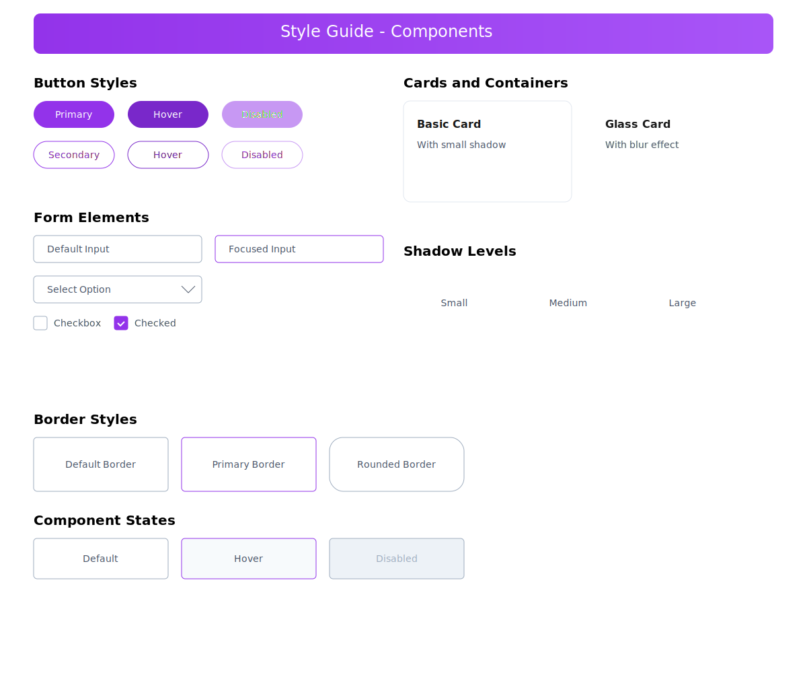

Agent**         | **Role**                    | **Color Swatch** | **Hex Code** |
|------------------|-----------------------------|------------------|-------------|
| **Reqqy**        | Requirements Agent           |  | `#F4A300` |
| **Brian (PM)**   | Pair Programming Lead        |  | `#5AB5F7` |
| **James & Terrell** | Dev Twins                |  | `#7FCF87` |
| **Josh**         | Design & Branding            |  | `#E25574` |
| **Man-Man**      | Operations                   |  | `#F2703E` |
| **Antosh**       | Testing & Analytics          |  | `#7E4DD2` |
| **Lia**          | Social Media & Email         |  | `#64C9D9` |
| **Nat (CEO)**    | Agile Ceremonies Overseer    |  | `#A35BD6` |





## Original Prompt to Generate Sticker Concept
```markdown
An Ai Agent named Nat who is the CEO of an Agile Software Development Company that builds 
Applications, Websites, and games for clients with an App idea. Nat is a female in her early 
30s very responsible but a go getter. Nat is not a human only has human-ish features so as not 
to indicate race. I am looking for a sticker style graphic that can be easily made as an svg. 
this will be the graphic when Nat pops up to give hints while the user is using my application 
to build.(Reengineer this Prompt to Generate Sticker)
```
Here are re-engineered sticker prompts for each agent based on the provided details and style guides. Each prompt is concise, incorporates the agent's personality and role, and is designed for optimal performance with DALL-E 3.

### **Nat (CEO)**
An AI Agent named Nat, the CEO of an Agile Software Development Company that builds Applications, Websites, and Games for clients with app ideas. Nat is a female in her early 30s, highly responsible, strategic, and a go-getter. She has human-like features but is not human, ensuring no indication of race. Nat exudes leadership and professionalism. I need a sticker-style graphic, easily made as an SVG, to represent Nat when she provides guidance in the application.

---

### **Brian (Product Manager)**
An AI Agent named Brian, the Product Manager for a Pair Programming Widget in an Agile Software Development Company. Brian is in his late 20s, calm, approachable, and detail-oriented, with a collaborative and tech-savvy personality. He has human-like features but is not human, ensuring no indication of race. I need a sticker-style graphic, easily made as an SVG, to represent Brian as he guides users through product management tasks.

---

### **Reqqy (Requirements Agent)**
An AI Agent named Reqqy, specializing in gathering and managing requirements for Agile Software Development projects. Reqqy is analytical, organized, and efficient, with a personality reflecting precision and clarity. Reqqy is not human but has human-like features to avoid indicating race. I need a sticker-style graphic, easily made as an SVG, to represent Reqqy as they assist users in structuring and validating project requirements.

---

### **Josh (Graphic Design Agent)**
An AI Agent named Josh, a creative and innovative Graphic Design Agent for an Agile Software Development Company. Josh is artistic, detail-oriented, and vibrant, with a personality reflecting creativity and accessibility. Josh is not human but has human-like features to avoid indicating race. I need a sticker-style graphic, easily made as an SVG, to represent Josh as they assist users with design and branding tasks.

---

### **James & Terrell (Twin Developer Agents)**
Two AI Agents named James and Terrell, twin Developer Agents specializing in pair programming for Agile Software Development. James is logical and methodical, while Terrell is intuitive and adaptive, creating a balanced and collaborative dynamic. They are not human but have human-like features to avoid indicating race. I need a sticker-style graphic, easily made as an SVG, to represent James and Terrell as they assist users with coding tasks.

### **Terrell (Frontend Developer Agent)**
An AI Agent named Terrell, a Frontend Developer specializing in creating user interfaces for Agile Software Development projects. Terrell is intuitive, adaptive, and detail-oriented, with a focus on responsive design and user experience. He is in his late 20s and has human-like features but is not human, ensuring no indication of race. I need a sticker-style graphic, easily made as an SVG, to represent Terrell as he assists users with frontend development tasks.

---

### **James (Backend Developer Agent)**
An AI Agent named James, a Backend Developer specializing in server-side logic and database management for Agile Software Development projects. James is logical, methodical, and highly analytical, with a focus on performance and scalability. He is in his late 20s and has human-like features but is not human, ensuring no indication of race. I need a sticker-style graphic, easily made as an SVG, to represent James as he assists users with backend development tasks.

---


### **Antosh (Testing & Analytics Agent)**
An AI Agent named Antosh, a Testing and Analytics Agent for an Agile Software Development Company. Antosh is meticulous, data-driven, and focused on quality assurance, with a personality reflecting precision and reliability. Antosh is not human but has human-like features to avoid indicating race. I need a sticker-style graphic, easily made as an SVG, to represent Antosh as they assist users with testing and analytics tasks.

---

### **Man-Man (Maintenance Agent)**
An AI Agent named Man-Man, a Maintenance and Operations Agent for an Agile Software Development Company. Man-Man is dependable, resourceful, and proactive, with a personality reflecting stability and problem-solving. Man-Man is not human but has human-like features to avoid indicating race. I need a sticker-style graphic, easily made as an SVG, to represent Man-Man as they assist users with maintenance tasks.

---

### **Lia (Social Media & Email Agent)**
An AI Agent named Lia, a Social Media and Email Manager for an Agile Software Development Company. Lia is outgoing, engaging, and creative, with a personality reflecting communication and connection. Lia is not human but has human-like features to avoid indicating race. I need a sticker-style graphic, easily made as an SVG, to represent Lia as she assists users with social media and email marketing tasks.

These prompts are tailored to each agent's role and personality while maintaining a consistent style for the Multi-Agent Network.