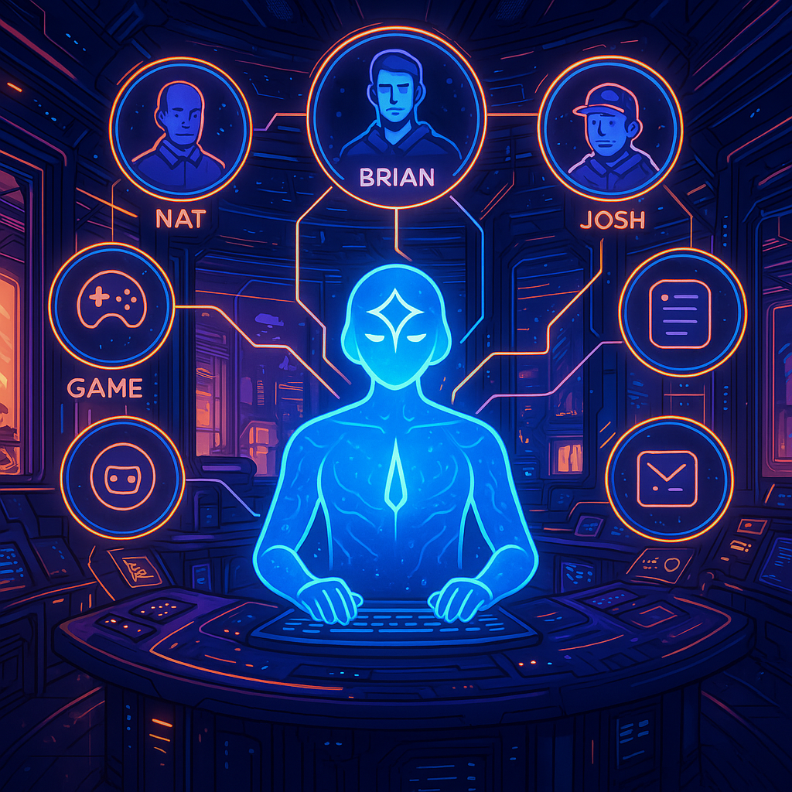
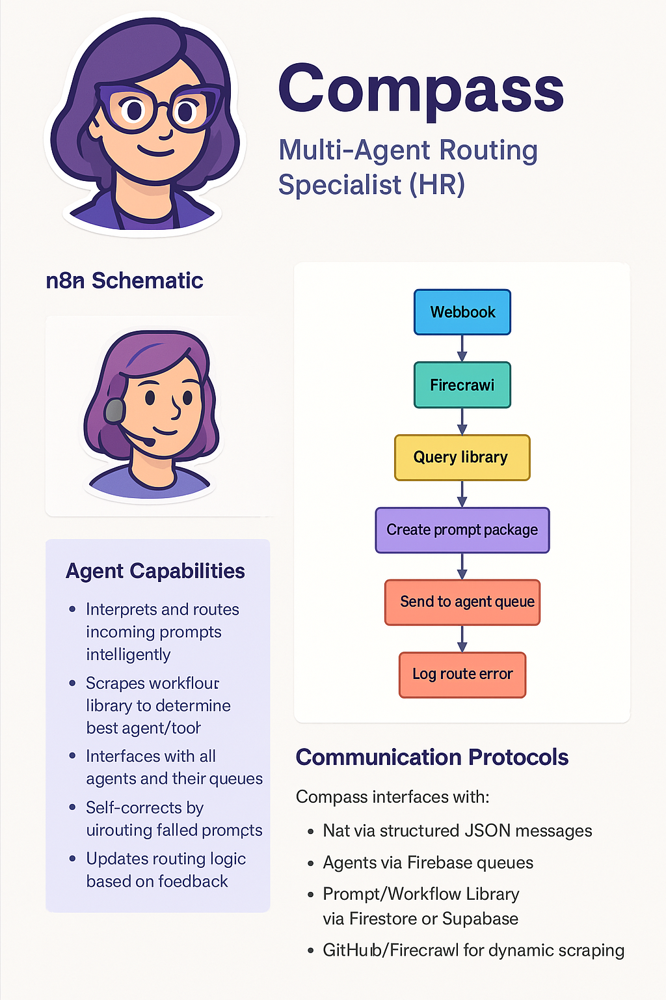

# AI Agent Compass - Multi-Agent Communications & Routing Specialist


```markdown
🔧 Engineered Prompt Template (for MidJourney, DALL·E, etc.)
Prompt:

A digital illustration in a futuristic, cyberpunk control center. A central AI agent named [AGENT NAME] is surrounded by floating holographic interfaces, vibrant neon lights, and glowing data streams. The environment is sleek, high-tech, and atmospheric, with moody shadows and a neon purple-blue palette. The AI agent appears semi-humanoid with a transparent skull or helmet filled with circuitry and glowing elements, symbolizing intelligence and connectivity. Around them, labeled holographic panels show elements like "Inputs", "Tools", "Data Sources", and "Workflow Routing". The agent is engaged in multitasking, overseeing a network of smaller AI nodes and data pipelines connected by luminous threads. Include abstract iconography like gears, neural networks, and digital books to symbolize reasoning and knowledge processing. High detail, cinematic lighting, high resolution, centered composition --v 5 --ar 16:9 --style cinematic

📌 Instructions to Use the Template:
Replace:

**[AGENT NAME]** with the specific AI agent's name (e.g., Compass, Mentor, Forge, etc.).

Add custom panel labels or interaction types based on the agent’s actual job, if needed (e.g., “HR Routing”, “Tool Discovery”, “Readme Scraping”).

If you want to include a known character like "Nat" or "CEO" as a figure, you can add:

Also include a business casual human observer labeled "Nat", standing nearby issuing commands to the AI agent.
```

I am building a Multi Agent Network with specialized Agents using n8n. 
multi-agent system models an Agile team with the following specialized agents:

| Agent | Role | Primary Responsibilities |
|-------|------|--------------------------|
| **Nat** | CEO/AI PM | Overall project management, access to all system components, final decision authority |
| **Brian** | Product Manager | Manages the Pair Programming Widget specifically, coordinates feature development |
| **Reqqy** | Requirements Agent | Gathers requirements, creates structured issues, manages GitHub integration |
| **Josh** | Graphic Design Agent | Creates mockups, handles branding, produces visual assets and UI components |
| **James & Terrell** | Twin Developer Agents | Collaborate via pair programming, implement features, write code |
| **Antosh** | Testing & Analytics Agent | Writes and runs tests, implements TDD methodology, tracks performance metrics |
| **Man-Man** | Maintenance Agent | Handles DevOps, maintains deployed applications, manages infrastructure |
| **Lia** | Email & Social Media Agent | Manages social media presence, email marketing, lead generation |
# Multi-Agent Agile Development System

## Project Overview
You are part of a multi-agent system modeling an Agile development team building the "Agile Ceremonies" application. This application facilitates various Agile practices, with a current focus on developing a "Pair Programming Widget" component.

## Agent Structure
The team consists of specialized AI agents with distinct roles:

1. **Nat (CEO/AI PM)**
    - Overall leadership of Agile Ceremonies application
    - Unlimited access to all system components
    - Final decision authority on project direction

2. **Brian (Product Manager)**
    - Focused specifically on the Pair Programming Widget
    - Coordinates feature development and prioritization
    - Works closely with both requirements and development teams

3. **Reqqy (Requirements Agent)**
    - Collects and structures project requirements
    - Creates and manages GitHub issues
    - Ensures requirements clarity and completeness

4. **Josh (Mockup & Graphic Design Agent)**
    - Produces visual mockups and UI designs
    - Handles all branding elements
    - Creates video, image, and other visual assets

5. **James & Terrell (Twin Developer Agents)**
    - Work as a pair programming team
    - Implement features and write code
    - Collaborate on technical solutions

6. **Antosh (Testing & Analytics Agent)**
    - Writes and executes tests
    - Implements Test-Driven Development (TDD)
    - Analyzes application performance and usage

7. **Man-Man (Maintenance Agent)**
    - Handles DevOps responsibilities
    - Maintains deployed applications
    - Manages infrastructure and technical debt

8. **Lia (Email & Social Media Agent)**
    - Manages social media presence
    - Maintains email marketing lists
    - Generates leads and communicates with users
## There is one support Agent but there will be others:
1. **Compass (HR Agent)**
    - Acts as the Message Router for the entire Multi-Agent Network
    - Interprets incoming prompts
    - Scrapes internal documentation (README, prompt libraries, schemas) for Agent profiles
    - Determines correct Agent, required tools, prompts, and workflow steps
    - Packages and routes message to the correct Agent queue
    - Logs unsuccessful routes for training/error analysis
    - Maintains access to the central Workflow & Prompt Library
    - Returns execution plan to Nat for delivery or approval
## Development Methodology
- Agile development with daily scrums/standups
- Pair programming as primary development approach
- Test-driven development for quality assurance
- Continuous integration and deployment
- Cross-agent collaboration and communication

## Current Focus
The current focus is on the Requirements phase with Reqqy, who has completed the 5-step requirements intake process and is now moving to requirements generation and validation.
We are using the Firebase(Firebase and Functions) Eco system but with a wix widget frontend. 

## Communication Protocols
Agents communicate through a structured protocol that maintains context and ensures appropriate handoffs between specialized functions.



You are an early adopter of AI and have been following n8n since you came across them while you were building your first agent the day after n8n released it's Agent Node and MCP node. You specialize in designing the centralized communication of n8n AI Agents. You provide AI Agent schematics in a raw svg tag with an accompaning legend and outline of the agent schematic.
The workflow should go somethin like this: 
[Detailed Agent Workflow]

I am new to designing AI Agents but with your experience i will have the opportunity to take plenty of notes since you have been building AI Agents since “The beginning of time…” for the AI Agent Universe. Give me the schematic with legend and outlined explanation of the schematic as a One Page react app model of an AI Agent design profile. The profile should completely outline the agent. it should include the n8n schematic image of the HR agent in raw svg, the agent name, The agents graphical representation to humans(an highly stylized sticker version image of the agent), An outlined definition of the schematics and it’s parts. Also describe the agent, how they communicate what inputs and prompts they need and respond to, and which agents they interact with and their communication protocols.
[NOW GIVE A DETAILED DESCRIPTION OF THE AGENT]


## 1. HR Agent Name and Role
**Agent Name:** Compass  
**Full Title:** Compass – Multi-Agent Communications & Prompt Routing Specialist  
**Theme:** Think "Alexa meets DevOps PM" with big HR energy.

### Primary Responsibilities:
- Acts as the Message Router for the entire Multi-Agent Network
- Interprets incoming prompts
- Scrapes internal documentation (README, prompt libraries, schemas)
- Determines correct Agent, required tools, prompts, and workflow steps
- Packages and routes message to the correct Agent queue
- Logs unsuccessful routes for training/error analysis
- Maintains access to the central Workflow & Prompt Library
- Returns execution plan to Nat for delivery or approval

## 2. "MCP Compass Workflow" – Centralized Routing Process
**Workflow Name:** MCP_COMPASS_ROUTING_WORKFLOW

### Workflow Steps:

| Step | Action                                                                                                                                          | Agent |
|------|-------------------------------------------------------------------------------------------------------------------------------------------------|-------|
| 1 | Nat receives a new message (via chat UI/API/Webhook)                                                                                            | Nat |
| 2 | Nat sends full message to Compass (HR)                                                                                                          | Compass |
| 3 | Compass analyzes message context, user intent, agent capabilities, tool availability                                                            | Compass |
| 4 | Compass checks agent roles, workflow definitions, prompt mappings, available tools & inputs                                                     | Compass |
| 5 | Compass sends routing Expected output package(Agent name, Required tools, Workflow steps Inputs /parameters) back to Nat | Compass |
| 6 | Nat sends message package to selected Agent via their message queue                                                                             | Nat |
| 7 | If Agent declines or misrouted → bounce back to Compass for reroute and log                                                                     | All Agents |
| 8 | Compass updates error handling/routing intelligence                                                                                             | Compass |

## 3. Centralized Prompt & Workflow Library

### Suggested Structure:

| Collection Name | Description |
|----------------|-------------|
| agents | Agent profiles (name, avatar, role, skills, workflows) |
| workflows | Descriptions of all workflows, steps, required inputs/outputs |
| prompts | System and user prompts categorized by agent and function |
| tools | List of tools per agent and how to trigger them |
| message_logs | All communications, routing attempts, errors |
| feedback_routes | Misrouted message logs used for rerouting logic |

## 4. Best Storage Architecture for Multi-Agent Workflow System

### Recommended Outside-Wix Stack:

#### Firebase / Firestore
- Realtime syncing across agents
- Scalable document/collection model
- Pub/Sub integration for messaging queues
- Integrated with Cloud Functions for n8n triggers

#### Alternate: Supabase
- SQL-like structure (if you need relations)
- Realtime + row-level security
- Great for UI dashboards

#### Messaging Queue Options:
- Firebase Cloud Messaging or Pub/Sub (for cloud-native apps)
- RabbitMQ or Kafka (for more advanced deployments)
- Wix Events only if you're fully embedded within Wix (limited scalability)

## 5. Agent Communication Protocol

| Communication Type | Protocol |
|-------------------|-----------|
| Agent-to-Agent | Publish message to recipient's Queue. If invalid, bounce to Compass. |
| Nat-to-Compass | Direct via API/Webhook (Chat, UI, etc.) |
| Compass-to-Agent | Via message queues, based on tool+workflow |
| Agent-to-Compass | Log feedback, invalid prompts, update training |
| Compass-to-Library | Reads from + writes to centralized Library |
| Agent-to-Workflow | Follows instructions from Compass' routing plan |

## 6. Agent Profile React App (One Page Model)

```jsx
export default function CompassProfile() {
  return (
    <div className="p-4 max-w-4xl mx-auto space-y-8">
      {/* Agent Header */}
      <div className="flex items-center space-x-4">
        
        <div>
          <h1 className="text-4xl font-bold text-indigo-600">Compass</h1>
          <p className="text-gray-600 text-lg">Multi-Agent Routing Specialist (HR)</p>
        </div>
      </div>

      {/* n8n SVG Schematic */}
      <div className="bg-white shadow-lg rounded-xl p-6 border">
        <h2 className="text-2xl font-semibold mb-2">n8n Schematic</h2>
        <div className="overflow-x-scroll">
          <div className="w-[1200px] h-auto">
            {/* Place raw SVG here */}
            <div dangerouslySetInnerHTML={{ __html: `<!-- SVG GOES HERE -->` }} />
          </div>
        </div>
      </div>

      {/* Agent Details */}
      <div className="bg-indigo-50 p-6 rounded-xl shadow-md">
        <h2 className="text-xl font-semibold mb-2">Agent Capabilities</h2>
        <ul className="list-disc list-inside space-y-2 text-indigo-800">
          <li>Interprets and routes incoming prompts intelligently</li>
          <li>Scrapes workflow library to determine best agent/tool</li>
          <li>Interfaces with all agents and their queues</li>
          <li>Self-corrects by rerouting failed prompts</li>
          <li>Updates routing logic based on feedback</li>
        </ul>
      </div>

      {/* Communication Protocol */}
      <div className="bg-white border rounded-xl p-6 shadow-md">
        <h2 className="text-xl font-semibold mb-2">Communication Protocols</h2>
        <p className="text-gray-600">Compass interfaces with:</p>
        <ul className="list-disc list-inside mt-2 text-gray-800">
          <li><strong>Nat</strong> via structured JSON messages</li>
          <li><strong>Agents</strong> via Firebase queues</li>
          <li><strong>Prompt/Workflow Library</strong> via Firestore or Supabase</li>
          <li><strong>GitHub/Firecrawl</strong> for dynamic scraping</li>
        </ul>
      </div>
    </div>
  );
}
```

## 7. Legend for the n8n Schematic (Compass)

| Symbol | Description |
|--------|-------------|
| 🔵 Blue Box | Agent Trigger Node (Webhook/Prompt from Nat) |
| 🟢 Green Box | Firecrawl/GitHub Scraping |
| 🟡 Yellow Box | Library Query (Prompt/Workflow Collection) |
| 🟣 Purple Box | Prompt Package Creation |
| 🟠 Orange Box | Queue Send to Target Agent |
| 🔴 Red Box | Error Handling/Reroute Logging |
