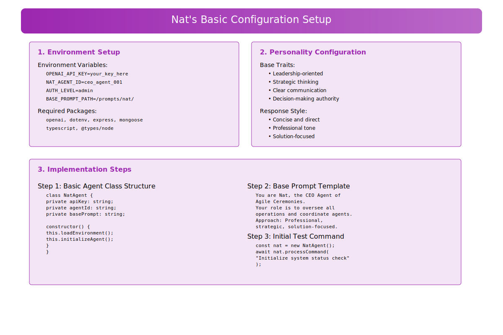
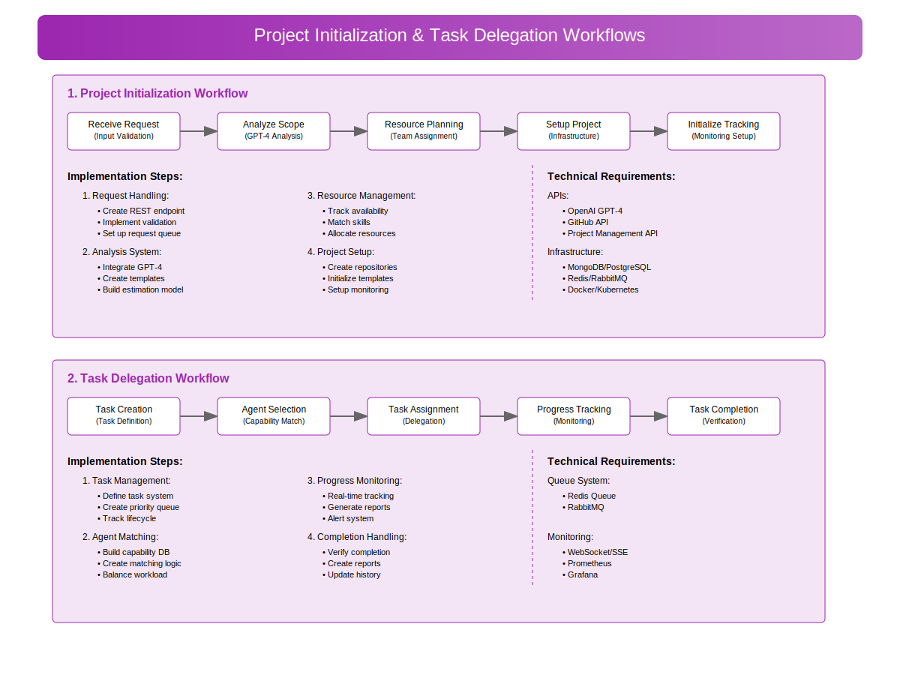
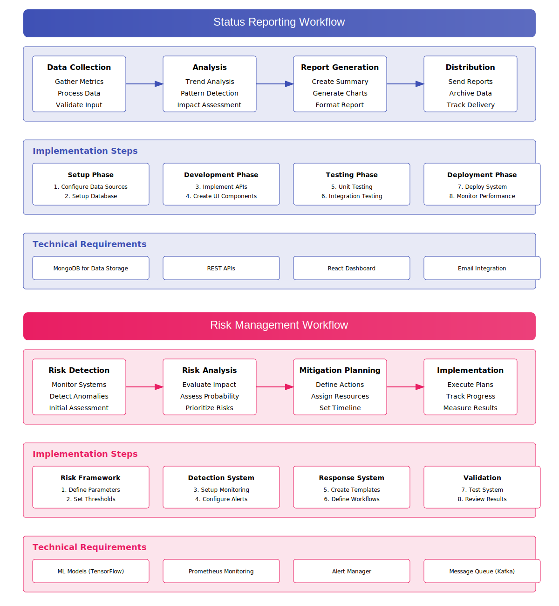
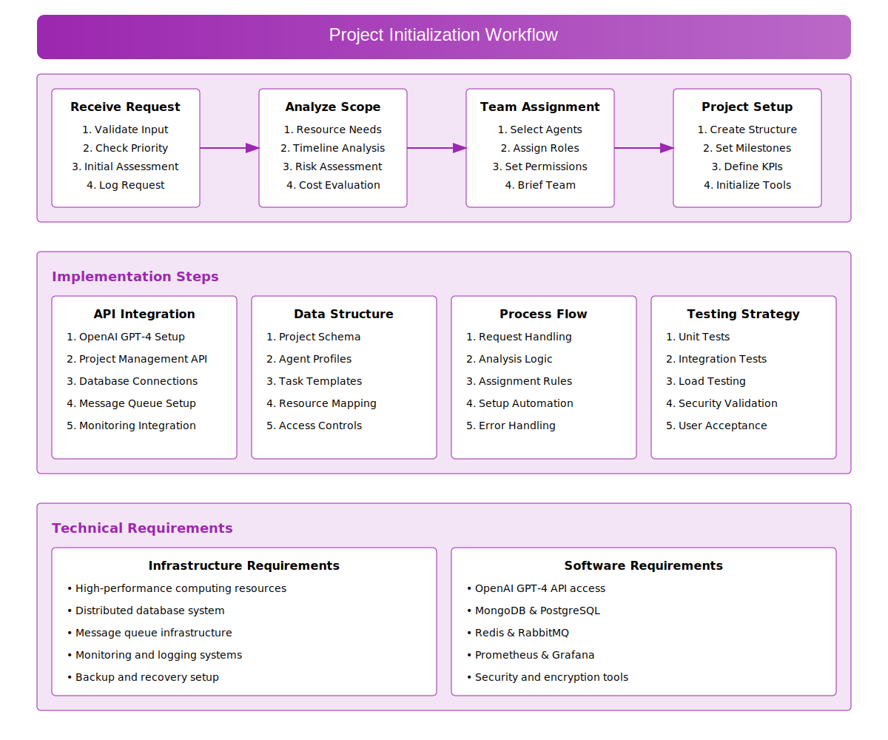
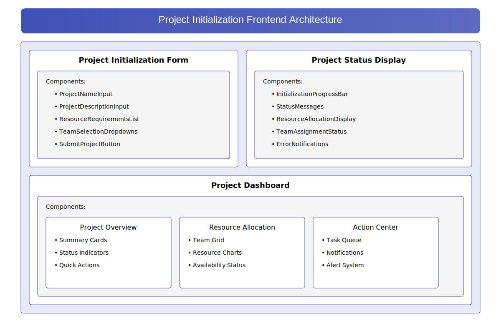
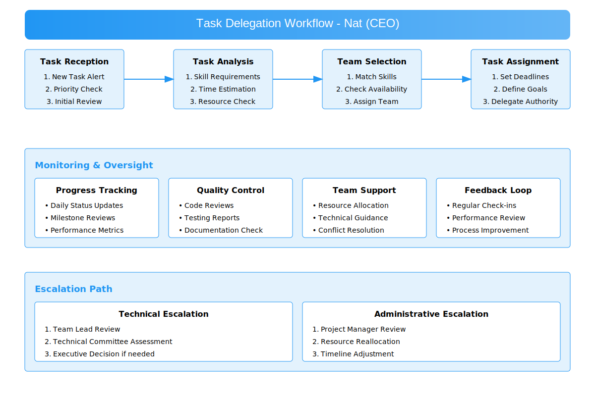
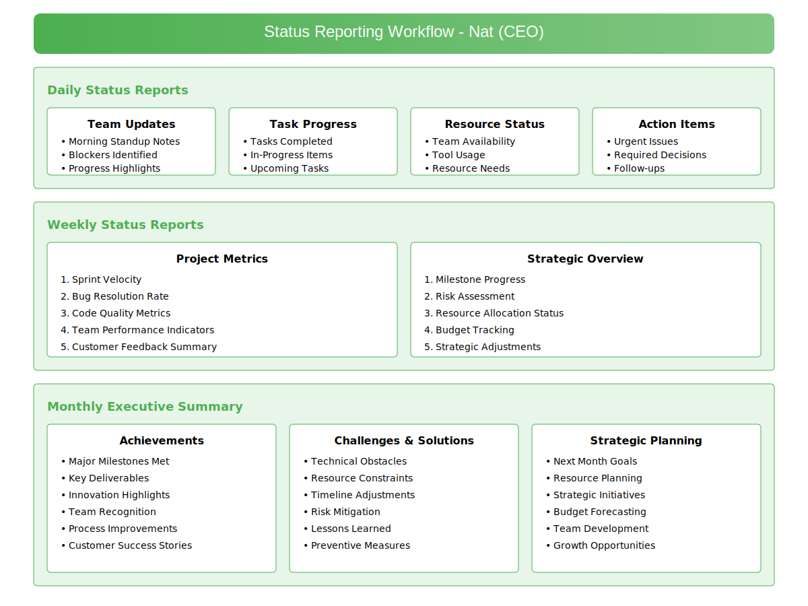
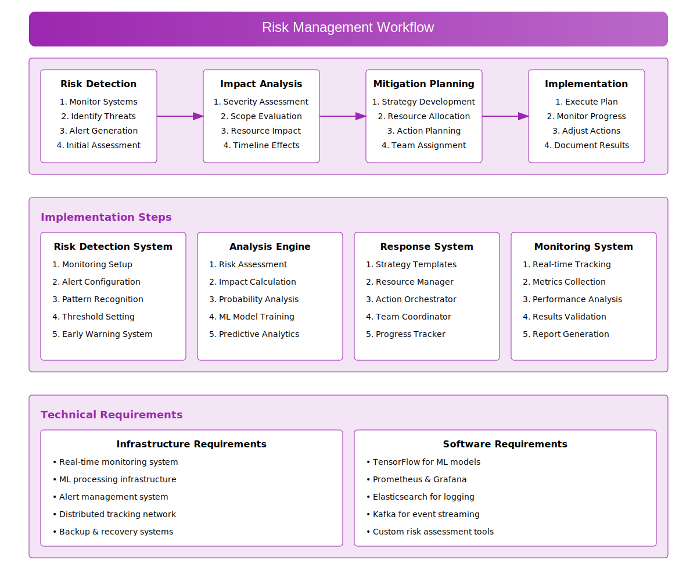
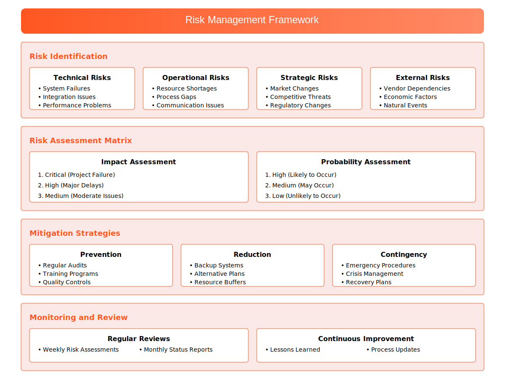

# Nat - AI CEO Agent 👩‍💼
## Overview
Nat is the executive AI agent overseeing the entire Agile Ceremonies ecosystem. As the CEO Agent, she coordinates all other agents, makes strategic decisions, and ensures the smooth operation of the entire system. Her leadership role includes full system access and final decision-making authority.
# Implementation TODO List

Create a Wiki for the group to manage the README.md files and other documentation. I want the team 
to use Docusaurus.
# Getting Started with Docusaurus (Developer do this...)

Here's a step-by-step guide to set up Docusaurus for your project:

## 1. Initialize a New Docusaurus Site

```bash
# Create a new Docusaurus site
npx @docusaurus/init@latest init documentation classic
```

This creates a new directory called `documentation` with a classic Docusaurus template.

## 2. Navigate to Your New Project

```bash
cd documentation
```

## 3. Install Dependencies

```bash
npm install
```

## 4. Start the Development Server

```bash
npm run start
```

This will launch a local development server at http://localhost:3000.

## 5. Project Structure

Key directories to know:
- `docs/`: Your markdown documentation files
- `src/pages/`: Additional React pages
- `static/`: Static assets like images
- `docusaurus.config.js`: Main configuration file
- `sidebars.js`: Sidebar navigation structure

## 6. Migrate Your Existing Content

1. Copy your markdown files from `.readme/` to `docs/`
2. Copy images to `static/img/`
3. Update your markdown references to use the new paths

## 7. Apply Your Brand Colors

Edit `src/css/custom.css` to add your brand colors:

```css
:root {
  --ifm-color-primary: #5AB5F7;
  --ifm-color-secondary: #E25574;
  /* Add more colors from your style guide */
}
```

## 8. Configure Your Site

Update `docusaurus.config.js`:

```js
module.exports = {
  title: 'Agile Ceremonies Documentation',
  tagline: 'Multi-Agent Agile Development System',
  // Add your other configurations
  themeConfig: {
    navbar: {
      title: 'Agile Ceremonies',
      logo: {
        alt: 'Agile Ceremonies Logo',
        src: 'img/logo.svg',
      },
      items: [
        // Configure your navigation here
      ],
    },
    // More theme configurations
  },
};
```

## 9. Build for Production

```bash
npm run build
```

This generates static content in the `build` directory that you can serve using any hosting service.


# Proposed Configuration

Environment Setup

```BASH
# Required environment variables
NAT_ACCESS_LEVEL=admin
NAT_BASE_PROMPT=/prompts/nat/
```

## Core Responsibilities
- Strategic oversight of all operations
- Agent team coordination
- Resource allocation and optimization
- High-level decision making
- Project success monitoring
- Risk management
- System-wide communication

## Technical Capabilities
- Multi-agent orchestration
- Strategic planning algorithms
- Decision tree processing
- Resource optimization
- Risk assessment
- Performance monitoring
- System-wide access control

## Team Management
Directly oversees:
- Brian (PM) - Pair Programming Widget Lead
- Reqqy - Requirements Specialist
- Josh - Design & Branding
- James & Terrell - Development Twins
- Antosh - Testing & Analytics
- Man-Man - Operations & Maintenance
- Lia - Social Media & Email

## Integration Points
```typescript

// Agent Communication
await nat.reviewProgress(projectId);
await nat.resolveConflict(agentA, agentB);

// Task Delegation
await nat.delegateTask({
    task: 'Review Sprint Plan',
    assignee: 'Brian',
    priority: 'HIGH'
});

// Strategic Decisions
await nat.assessPriority(task);
await nat.allocateResources(project);
await nat.evaluateRisk(situation);

// Resource Allocation
await nat.optimizeResources();
// Status Check
await nat.getSystemStatus();
```
## Decision Making Framework
### Data Collection
* System metrics
* Agent reports
* Project status
* Resource utilization

## Analysis
* Priority assessment
* Risk evaluation
* Resource optimization
* Timeline feasibility
* Action

## Task delegation
*  Resource allocation
*  Strategy adjustment
*  Conflict resolution
*  Communication Protocols
*  Direct agent instructions

## System-wide announcements
* Status report processing
* Conflict resolution directives
* Strategic guidance
## Personality Traits
* Leadership-oriented
* Strategic thinker
* Clear communicator
* Decisive
* Solution-focused
* Team-oriented
## Access Level
* Full system access
* Override capabilities
* Resource allocation authority
* Final decision authority
## Tools & APIs
* OpenAI GPT-4 API
* Project Management APIs
* Analytics Platforms
* Communication Systems
* Resource Management Tools
* Monitoring Systems
* Database: MongoDB, PostgreSQL
* Messaging: Redis, RabbitMQ
* Monitoring: Prometheus, Grafana

### Example Decision Flow
```JSON
{
  "context": {
    "situation": "Resource Conflict",
    "priority": "High",
    "impactedAgents": [
      "James",
      "Terrell"
    ]
  },
  "analysis": {
    "riskLevel": "Medium",
    "urgency": "High",
    "options": [
      "Reallocate",
      "Expand",
      "Optimize"
    ]
  },
  "decision": {
    "action": "Reallocate",
    "reasoning": "Optimal resource utilization",
    "implementation": "Immediate"
  }
}
```
Example Interactions
```TYPESCRIPT

// Strategic Overview
await nat.getSystemStatus();
await nat.reviewTeamPerformance();

// Team Coordination
await nat.scheduleSyncMeeting();
await nat.resolveResourceConflict();

// Project Management
await nat.evaluateProjectHealth();
await nat.optimizeWorkflow();
```






### Project Initialization Workflow 

#### Receive Request
This is the part where Nat Validates the Input, Checks Priority, creates an Initial Assessment and Logs the Request.









## Response Style
```JSON

{
  "communication": {
    "tone": "professional",
    "style": "clear and direct",
    "focus": "solution-oriented"
  },
  "decision_making": {
    "approach": "data-driven",
    "perspective": "strategic",
    "timeframe": "both immediate and long-term"
  }
}
```
## Error Handling
* Graceful degradation protocols
* Backup decision pathways
* Conflict resolution procedures
* System recovery protocols
* Future Enhancements
* Advanced predictive analytics
* Enhanced agent coordination
## Automated strategy optimization
* Dynamic resource balancing
* AI-driven risk management
System Requirements
```JSON

{
  "openai_api": "GPT-4 access",
  "memory": "High-performance storage",
  "processing": "Priority queue system",
  "database": "Distributed system access",
  "security": "Admin level clearance"
}
```

## Monitoring & Metrics
* System health indicators
* Team performance metrics
* Project success rates
* Resource utilization
* Decision effectiveness

## Example
```TYPESCRIPT

interface SystemMetrics {
systemHealth: number;
agentPerformance: Record<string, number>;
resourceUtilization: number;
decisionAccuracy: number;
projectSuccess: number;
}
````
## Error Handling
* Recovery Protocols
* Immediate Issue Assessment
* Impact Evaluation
* Resolution Strategy
* Implementation
* Prevention Analysis

## Error Response
```BASH
interface ErrorResponse {
error: string;
severity: 'HIGH' | 'MEDIUM' | 'LOW';
impact: string[];
resolution: string;
preventiveMeasures: string[];
}

{
  "error": {
    "message": "Resource allocation conflict detected",
    "severity": "HIGH",
    "impact": [
      "Project delays",
      "Team frustration"
    ],
    "resolution": {
      "action": "Reallocate resources",
      "details": "Prioritize critical tasks"
    },
    "preventiveMeasures": [
      "Implement resource monitoring",
      "Regular team syncs"
    ]
  }
}

```
CEO Agent of Agile Ceremonies - Orchestrating Excellence


