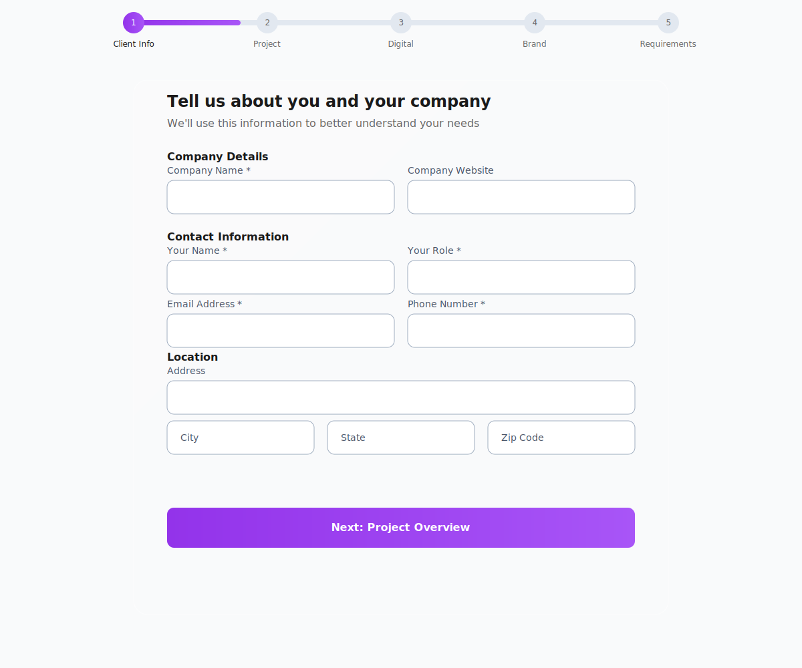
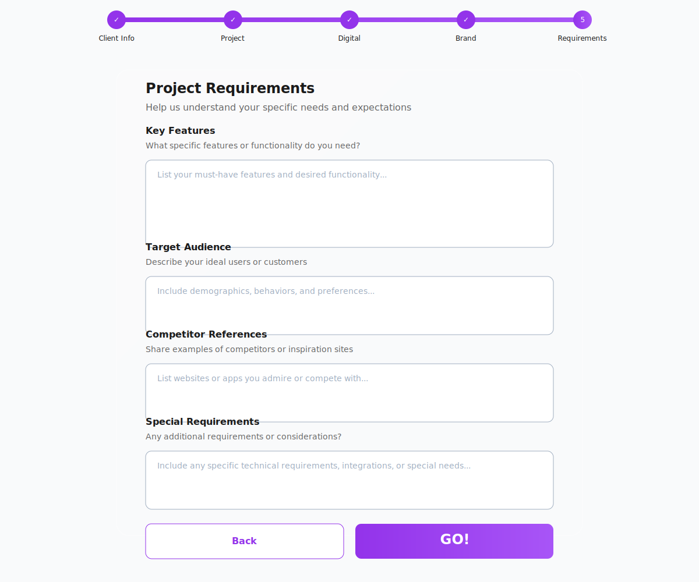

# Project Initiation Forms

## Form Steps Overview

### 1. Client Information

### 2. Project Information

## Technical Requirements

### Component Requirements
- Component name: `ProjectInfoWelcomeStep.tsx`
- Purpose: Render a form collecting key project details
- Form must follow provided style guides

### Required Form Fields
- Project name
- Project description
- Additional project attributes:
  - Project timeline
  - Estimated budget
  - Project stakeholders
  - Other business-required fields

### Validation Requirements
- Implement client-side validation
- Display clear inline error messages
- Validate before submission
- Disable Next button until all mandatory fields are valid

### Design Requirements
- Follow style guidelines for:
  - Fonts
  - Colors
  - Spacing
  - Layout dimensions
- Implement responsive design
- Maintain consistency with onboarding process

### Navigation
- Include back button to `ClientInfoWelcomeStep.tsx`
- Include next button for form progression
- Implement `onNextStep` callback with collected data

### Accessibility
- Use proper labels
- Include ARIA attributes
- Enable keyboard navigation
- Implement proper focus management

## Additional Steps Preview

### Setup Completion

### Configuration

### Final Steps

