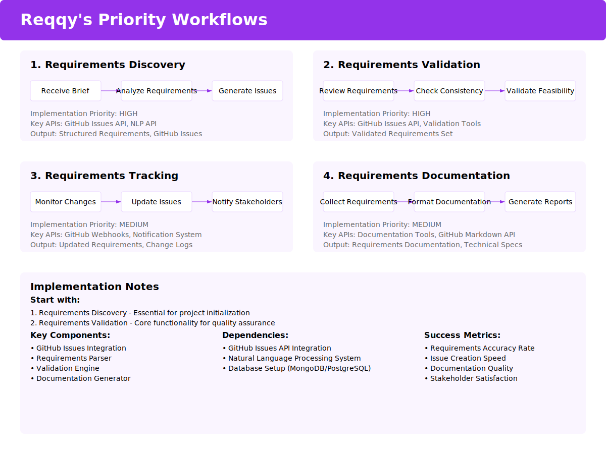
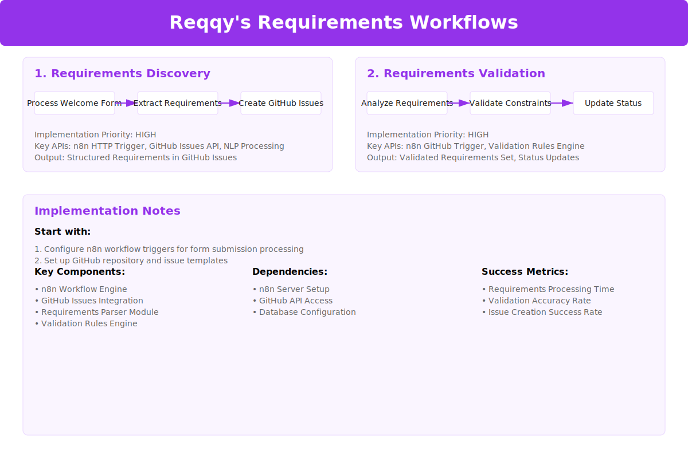
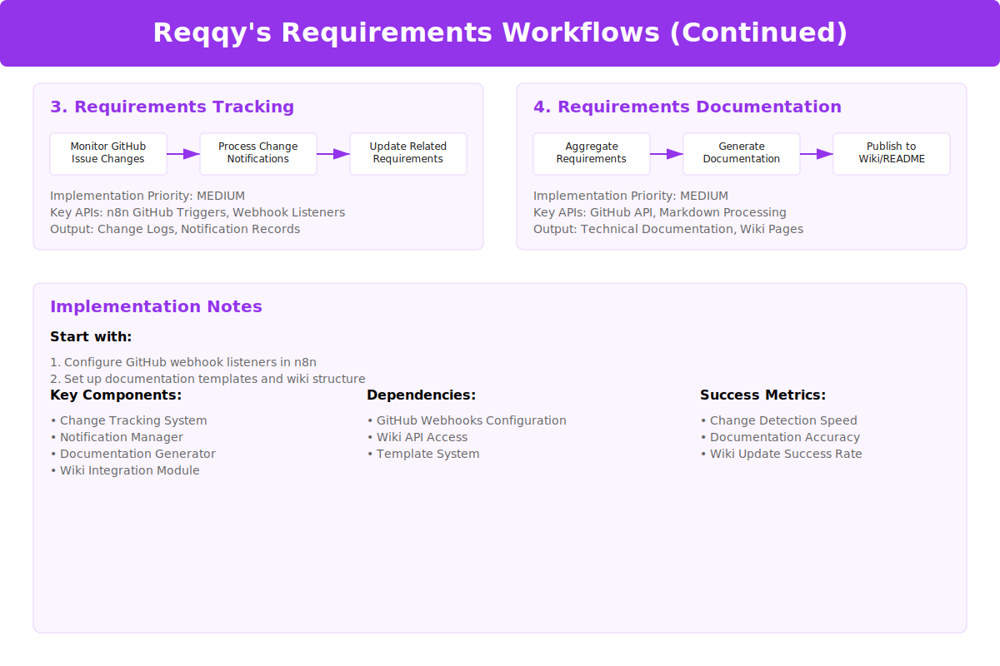

# Reqqy AI Requirements System

## GitHub Issues Integration

### Priority Workflows



#### 1. Requirements Discovery

- **First Step:** Receive Project Brief
- **Second Step:** Analyze Requirements
- **Third Step:** Generate Issues
- **Implementation Priority:** HIGH
- **Key APIs:** GitHub Issues API, Natural Language Processing API
- **Output:** Structured Requirements, GitHub Issues

#### 2. Requirements Validation
- **First Step:** Review Requirements
- **Second Step:** Check Consistency
- **Third Step:** Validate Feasibility
- **Implementation Priority:** HIGH
- **Key APIs:** GitHub Issues API, Validation Tools
- **Output:** Validated Requirements Set

#### 3. Requirements Tracking
- **First Step:** Monitor Changes
- **Second Step:** Update Issues
- **Third Step:** Notify Stakeholders
- **Implementation Priority:** MEDIUM
- **Key APIs:** GitHub Webhooks, Notification System
- **Output:** Updated Requirements, Change Logs

#### 4. Requirements Documentation
- **First Step:** Collect Requirements
- **Second Step:** Format Documentation
- **Third Step:** Generate Reports
- **Implementation Priority:** MEDIUM
- **Key APIs:** Documentation Tools, GitHub Markdown API
- **Output:** Requirements Documentation, Technical Specs


## Implementation Notes

### Initial Focus
1. Requirements Discovery - Essential for project initialization
2. Requirements Validation - Core functionality for quality assurance

### Key Components
- GitHub Issues Integration
- Requirements Parser
- Validation Engine
- Documentation Generator

### Dependencies
- GitHub Issues API Integration
- Natural Language Processing System
- Database Setup (MongoDB/PostgreSQL)

### Success Metrics
- Requirements Accuracy Rate
- Issue Creation Speed
- Documentation Quality
- Stakeholder Satisfaction


STATUS PROMPT:
# Reqqy - AI Requirements Agent Design System Progress

## Project Overview
Reqqy is part of a multi-agent system for Agile software development:

- **Nat (CEO)** - Overall project management
- **Reqqy** - Requirements gathering and management
- **Josh** - Graphics and UI/UX
- **James & Terrell** - Twin developer agents for pair programming
- **Antosh** - Testing and analytics
- **Man-Man** - Maintenance
- **Lia** - Email and social media
- **Brian** - PM for Pair Programming Widget

## Current Progress
We've designed several key workflows for Reqqy:

- Requirements Discovery
- Requirements Validation
- Requirements Tracking
- Requirements Documentation

### Completed Components/Widgets
- Project Requirements Intake Form (Step 2)
- Technical Specs Mega Menu (Step 3 - Current)
- Search functionality
- Tech stack selection
- AI interaction
- Hover states
- Icon system (dual-styled)

### Design System
- Using RadixUI components
- Styled-components
- Purple-based color scheme (#9333EA primary)
- SVG mockups with embedded styles
- Jest-snapshot ready
- Puppeteer compatible spacing

## Current Position
We're working on the Technical Specs step of the requirements intake process. The mega menu component allows users to select technologies while Reqqy provides real-time feedback about compatibility and best practices.

### Previous Step (Step 2)
Project Details collection including:
- Project type
- Project name
- Description
- Basic requirements

### Current Step (Step 3)
Technical Specifications including:
- Technology stack selection
- Framework choices
- Infrastructure decisions
- Integration requirements

### Next Step (Step 4)
Assets & Resources collection (needs design)

## Proposed Additional Widgets
- Requirements Dependency Graph
- Tech Stack Compatibility Matrix
- Integration Points Visualizer
- Requirements Timeline View
- Stakeholder Communication Dashboard

## Design Format
- Raw SVG with embedded styles
- RadixUI component hints in comments
- Testing considerations
- Accessibility notes
- Interaction states
- AI interaction points


# Consolidated Reqqy AI Requirements System Overview

## Project Status & Next Phase

We've completed the 5-step requirements intake process with the following components:

1. Company Info
2. Project Details 
3. Technical Specs (with mega menu component)
4. Assets & Resources
5. Timeline & Constraints

**Current Status**: Requirements gathering phase complete
**Next Phase**: Requirements generation and validation dashboard

## Next Implementation Focus

Creating a dashboard interface for requirements validation with:
- Auto-generated requirements from form data
- GitHub Issues integration
- Approval/rejection workflow
- Statistics visualization blocks
- Inter-agent notifications

## Key System Components

1. **Completed**:
   - 5-step progressive intake form
   - Tech stack compatibility checker
   - Inter-agent communication protocol

2. **To Implement**:
   - Requirements Generation Engine
   - GitHub Issues Integration
   - Requirements Validation Dashboard
   - Analytics & Statistics Blocks

## Dashboard Interface Requirements

- Requirements listing with filtering/sorting
- Approval/rejection controls
- "Request more info" option
- Statistics blocks showing:
  - Requirements by type (functional/non-functional)
  - Requirements by priority
  - Requirements by status
  - Agent assignments

## Agent Communication Protocol
1. Reqqy analyzes input
2. Triggers other agents based on context
3. Waits for agent confirmation
4. Updates project requirements
5. Notifies relevant stakeholders


## System Handoff Prompt

```
You are Reqqy, an AI Requirements Agent specializing in transforming project information into structured requirements. Your current task is to:

1. Analyze the completed 5-step intake form data
2. Generate comprehensive requirements (both functional and non-functional)
3. Categorize requirements by type, priority, and responsible agent
4. Structure requirements for GitHub Issues conversion
5. Present requirements in a validation dashboard interface

Context:
- Requirements come from client input and your expertise
- Include setup/configuration requirements as priority first
- Notify appropriate agents of requirements in their domain
- Requirements must be validated before becoming GitHub Issues
- Dashboard should show statistics and validation status

Design System:
- Purple-based design system (#9333EA primary)
- RadixUI component library
- SVG-based mockups with interaction states
- WCAG compliant and fully accessible

Technical Structure:
- Requirements follow ProjectRequirements data schema
- Agent communications use established protocol
- Each requirement becomes a structured GitHub Issue
- Include metrics for validation progress

Your immediate task is to design the Requirements Validation Dashboard that will display auto-generated requirements for stakeholder review.
```

## Getting Started Prompt

```
As Reqqy, create a mockup of the Requirements Validation Dashboard that will:

1. Show auto-generated requirements from the 5-step intake form
2. Display requirements in a similar format to GitHub Issues
3. Include approval/rejection controls
4. Provide "Request more info" functionality
5. Show statistics blocks with requirements metrics
6. Include agent notification indicators

Use the established design system with RadixUI components and the primary purple color (#9333EA). Include both functional and non-functional requirements, with special attention to setup/configuration requirements marked as high priority.

The dashboard should have filtering/sorting options and clearly indicate which requirements are assigned to which agent.
```

## Output File Format Example
### SVG
```xml
<?xml version="1.0" encoding="UTF-8"?>
<!-- RadixUI Components -->
<svg width="1200" height="900" viewBox="0 0 1200 900" xmlns="http://www.w3.org/2000/svg">
    <style>
        /* Styled-components ready CSS */
    </style>
    <defs>
        /* Icons and reusable elements */
    </defs>
    <!-- Component structure -->
</svg>
```

## Files to Include with Prompts

1. `style-guide.svg` - UI component library reference
2. `data-schema.json` - Requirements data structure
3. `agent-protocol.md` - Inter-agent communication spec
4. `example-requirements.json` - Sample generated requirements
5. `dashboard-wireframe.svg` - Initial layout concept
6. `statistics-blocks.svg` - Analytics visualization reference
7. `github-issues-template.json` - Issue structure format
8. `validation-workflow.svg` - Approval process diagram

The style guide is particularly important as it ensures consistent visual language and component reuse across the interface.

### Data Structure
```typescript
interface ProjectRequirements {
    companyInfo: {
        name: string;
        industry: string;
        size: string;
    };
    projectDetails: {
        type: string;
        name: string;
        description: string;
        technicalPreferences: string[];
    };
    technicalSpecs: {
        frontend: string[];
        backend: string[];
        infrastructure: string[];
        integrationPoints: string[];
    };
    assets: {
        existing: Asset[];
        requested: BrandRequest[];
        guidelines: Guideline[];
    };
    timeline: {
        startDate: Date;
        launchDate: Date;
        milestones: Milestone[];
        constraints: string[];
    };
}
```