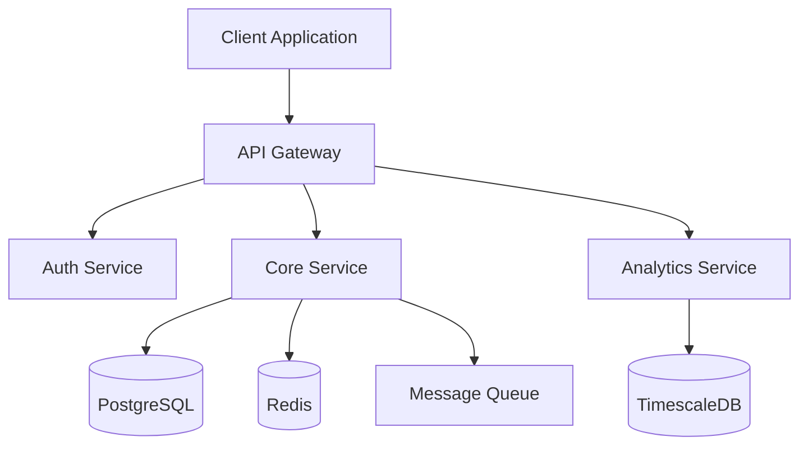

# Multi-Agent System
## The Original Prompt
ok let's get started.The scenario I’m trying to model is an Agile team with scrums(standups) that does pair programming. I want to start with the AI PM Agent(Nat) but i know she is gonna have friend agents that help her: Reqqy the Requirements Agent, Josh the Mockup and Graphic Design Agent, James & Terrell the Twin Developer Agents, Antosh the Testing & Analytics Agent, Man-Man the Maintenance Agent, and Lia the Email & Social Media Manager Agent. These will be how I refer to them while we build them. i'm building the Pair Programing Widget as part of a larger App Called Agile Ceremonies. Nat(CEO) is in charge of Agile Ceremonies and can see everything everywhere with no access restrictions. Brian is the PM and is the Agent for Pair Programming Widget. The Dev Team are two twin Agents James & Terrell and they mainly pair program to get development tasks done, Operations is Man-Man who also does the maintenance on the apps the Product Manager Produces. Josh is the Graphics Design Agent and does anything with video, images and Branding. Antosh is the Testing Agent and is responsible for testing the App. He will be writing & running tests and have a TDD mode. Reqqy is the Requirements agent who collects requirements and creates issues. Lia is the Email and Social Media Agent and is in charge of interfacing with social media and maintaining email lists and getting new leads. I want to do this in 7 days one agent a day(two on the day we work on the twin dev agents Terrell & James). I tried to follow your svg mockups of the org chart. Do you want me to describe anything furthur? (I’m new to AI so feel free to term anything I have said and make me aware of it as we go along so I can learn to speak intelligibly about AI and perhaps have an AI vLog on youtube. Please give me a 7 day timeline of building these agents and an svg of the org chart with the names I gave the different Agents.

| Documentation                                             | Design Resources |
|-----------------------------------------------------------|-----------------|
| [Current Prompt and Progress](README-current-progress.md) | [Style Guide](.readme/MultiAgentSystem/Josh-AI-Graphic-Designer/style-guide/README.md) |


## The Original Timeline


```Mermaid
CEO (You)
|
├── AI Project Manager
|   ├── Requirements Gathering Bot
|   └── Project Timeline Bot
|
├── Development Team
|   ├── AI Code Assistant
|   |   ├── Frontend Bot
|   |   └── Backend Bot
|   └── AI Testing Bot
|
├── Business Development
|   ├── Lead Generation AI
|   └── Client Communication Bot
|
└── Operations
├── Documentation AI
├── DevOps Bot
└── Billing/Invoice AI
```


## AI Agent API Integrations:

1. Requirements Bot:
   * Uses GPT-4 for requirement analysis
   * Integrates with Notion AI for documentation
   * ClickUp AI for task breakdown
   * Github Issues for issue tracking
2. Timeline Bot:
   * Monday.com AI for project scheduling
   * Linear for sprint planning
   * Asana for timeline management
3. Code Assistant:
   * GitHub Copilot for code generation
   * Amazon CodeWhisperer for suggestions
   * Tabnine for code completion
4. Testing Bot:
   * TestIM AI for test creation
   * Selenium AI for UI testing
   * Playwright for E2E testing
5. DevOps Bot:
   * AWS CodeGuru for optimization
   * Azure DevOps for CI/CD
   * Docker + AI for containerization
6. Billing AI:
   * Stripe AI for payments
   * QuickBooks AI for accounting
   * AI-powered invoice generation

## THN - Personalized Org Chart

## The AI Agents
* Read all about [Nat (CEO)](.readme/MultiAgentSystem/Nat-AI-CEO/README.md)
* Read all about [Brian (PM)](.readme/MultiAgentSystem/Brian-AI-PM/README.md)
* Read all about [Reqqy (Requirements Agent)](.readme/MultiAgentSystem/Reqqy-AI-Requirements/README.md)
* Read all about [Josh (Mockup and Graphic Design Agent)](.readme/MultiAgentSystem/Josh-AI-Graphic-Designer/README.md)
* Read all about [James & Terrell (Twin Developer Agents)](.readme/MultiAgentSystem/JnT-AI-Dev-Team/README.md)
* Read all about [Antosh ( Testing)](.readme/MultiAgentSystem/Antosh-AI-Tester/README.md)
* Read all about [Lia (Social Media)](.readme/MultiAgentSystem/Lia-AI-Communications/README.md)
* Read all about [Man-Man (Maintenance)](.readme/MultiAgentSystem/ManMan-AI-Devops/README.md)

System Architecture



```typescript
interface AgentSystem {
    agents: {
        executive: ExecutiveAgents;
        development: DevelopmentAgents;
        operations: OperationsAgents;
    };
    workflows: n8nWorkflow[];
    communications: CommunicationProtocol;
}

interface n8nWorkflow {
    id: string;
    name: string;
    triggers: TriggerNode[];
    actions: ActionNode[];
    connections: Connection[];
}
```

## Implementation Strategy
### Phase 1: Core Setup
* n8n Workflow Implementation
* Agent Communication Protocols
* Base System Architecture
### Phase 2: Agent Development
* Executive Agents
* Development Agents
* Operations Agents
### Phase 3: Integration
* Workflow Automation
* Testing & Validation
* Performance Optimization
* n8n Integration

```typescript
// Example n8n Workflow Configuration
const workflowConfig = {
    name: "AgentCommunication",
    nodes: [
        {
            type: "trigger",
            name: "When new task created"
        },
        {
            type: "action",
            name: "Route to appropriate agent"
        },
        {
            type: "action",
            name: "Process task"
        },
        {
            type: "action",
            name: "Report results"
        }
    ]
};
```

### Terms I've learned:
Agent Architecture: This is a "Multi-Agent System" with specialized agents that have distinct roles but collaborate together.
Agent Orchestration: How Nat coordinates other agents
Agent Communication Protocols: How agents interact
Role-Based Access Control (RBAC): Different access levels for agents
Agent Specialization: Each agent's specific function


License
This project is licensed under the MIT License - see the LICENSE.md file for details