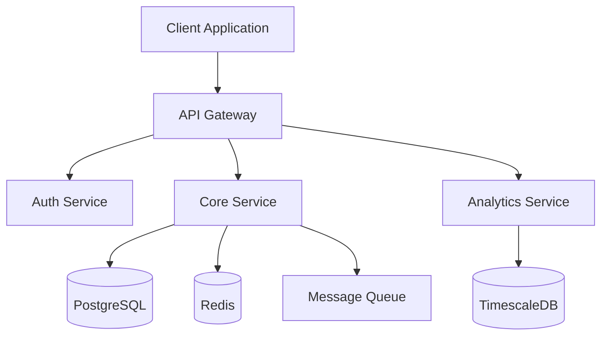

# agile-ceremonies

This project was bootstrapped with [Create Wix App](https://www.npmjs.com/package/@wix/create-app).  
## How was this Repo created?
## Create the overall Application
```console
 npm create @wix/app@latest
```
## Generate a widget in the application
```console
 cd new-wix-app
 npm run generate
```
There will be a couple of menu options
### For this Repo the Widget > Custom Element was selected 
* Widget for an application that can be installed as a Wix Widget
* Custom Element so that I can use React & Typescript in my IDE


Read more about it in the [Wix CLI for Apps
 documentation](https://dev.wix.com/docs/build-apps/developer-tools/cli/get-started/about-the-wix-cli-for-apps).

## Setup 🔧

##### Install dependencies:

```console
npm install
```

## Available Scripts

In the project directory, you can run:

```console
npm run dev
```
# Agile Ceremonies Management Application Specification

## 1. System Overview & Architecture

### 1.1 Core Features
- Virtual Standup Management
- Pair Programming Coordination
- Task & Requirement Tracking
- Team Analytics & Insights
- Widget-based Extensible Platform

### 1.2 Technical Stack

#### Frontend
- React 18+
- @wix/design-system
- Radix UI
- Framer Motion (animations)
- React Query (data fetching)
- Zustand (state management)

#### Backend
- Node.js with Express
- PostgreSQL
- Redis (caching & real-time)
- WebSocket (real-time updates)
- OpenAI API integration

#### Infrastructure
- Docker
- Kubernetes
- GitHub Actions (CI/CD)
- AWS (cloud infrastructure)

### 1.3 System Architecture


Performance Optimizations:
frontend:
```javascript 
// Performance configuration
export const performanceConfig = {
  caching: {
    queryCache: {
      staleTime: 5 * 60 * 1000, // 5 minutes
      cacheTime: 30 * 60 * 1000 // 30 minutes
    },
    localStorage: {
      version: '1.0',
      maxAge: 24 * 60 * 60 * 1000 // 24 hours
    }
  },
  
  virtualization: {
    enableThreshold: 50, // items
    rowHeight: 40,
    overscan: 5
  },

  optimization: {
    imageCompression: true,
    lazyLoading: true,
    prefetching: true
  }
};
```
backend:
```javascript
// Server optimization configuration
export const serverConfig = {
  cache: {
    redis: {
      maxMemoryPolicy: 'allkeys-lru',
      maxMemory: '2gb'
    }
  },
  
  scaling: {
    maxWorkers: 4,
    autoScale: true
  },

  rateLimit: {
    window: 15 * 60 * 1000, // 15 minutes
    max: 100 // requests per window
  }
};

```YAML

API Structure:
openapi: 3.0.0
info:
title: Agile Ceremonies API
version: 1.0.0
description: API for managing Agile ceremonies and team collaboration

servers:
- url: https://api.agileceremonies.com/v1
  description: Production server
- url: https://staging-api.agileceremonies.com/v1
  description: Staging server

components:
securitySchemes:
bearerAuth:
type: http
scheme: bearer
bearerFormat: JWT
oauth2:
type: oauth2
flows:
authorizationCode:
authorizationUrl: https://api.agileceremonies.com/oauth/authorize
tokenUrl: https://api.agileceremonies.com/oauth/token
scopes:
read: Read access
write: Write access
admin: Admin access

paths:
/auth:
post:
summary: Authenticate user
requestBody:
required: true
content:
application/json:
schema:
$ref: '#/components/schemas/AuthRequest'
responses:
'200':
description: Authentication successful
content:
application/json:
schema:
$ref: '#/components/schemas/AuthResponse'

/standups:
get:
summary: Get standup entries
parameters:
- in: query
name: teamId
schema:
type: string
required: true
post:
summary: Submit standup entry
requestBody:
required: true
content:
application/json:
schema:
$ref: '#/components/schemas/StandupEntry'```

Part 2: Component Library & Design System
2.1 Design System Integration
```TYPESCRIPT

Collapse
// styles/theme.ts
import { createTheme } from '@wix/design-system';
import { createStitches } from '@stitches/react';

export const { styled, css, theme, createTheme: createRadixTheme } = createStitches({
  theme: {
    colors: {
      // Semantic colors
      primary: '$blue500',
      secondary: '$purple500',
      success: '$green500',
      warning: '$yellow500',
      error: '$red500',
      
      // UI colors
      background: '$gray50',
      surface: 'white',
      textPrimary: '$gray900',
      textSecondary: '$gray600',
    },
    
    space: {
      1: '4px',
      2: '8px',
      3: '12px',
      4: '16px',
      5: '24px',
      6: '32px',
      7: '48px',
      8: '64px',
    },
    
    radii: {
      sm: '4px',
      md: '8px',
      lg: '12px',
      round: '9999px',
    },
    
    shadows: {
      sm: '0 1px 3px rgba(0,0,0,0.12)',
      md: '0 4px 6px rgba(0,0,0,0.12)',
      lg: '0 10px 15px rgba(0,0,0,0.12)',
    },
  },
});```
2.2 Shared Components
```TYPESCRIPT

Collapse
// components/shared/Card.tsx
import { Card as WixCard } from '@wix/design-system';
import * as Radix from '@radix-ui/react-primitive';

interface CardProps {
  elevation?: 'none' | 'low' | 'medium' | 'high';
  interactive?: boolean;
  children: React.ReactNode;
}

export const Card = styled(WixCard, {
  variants: {
    elevation: {
      none: {},
      low: { boxShadow: '$shadows$sm' },
      medium: { boxShadow: '$shadows$md' },
      high: { boxShadow: '$shadows$lg' },
    },
    interactive: {
      true: {
        cursor: 'pointer',
        transition: 'transform 0.2s ease',
        '&:hover': {
          transform: 'translateY(-2px)',
        },
      },
    },
  },
  defaultVariants: {
    elevation: 'low',
    interactive: false,
  },
});

// components/shared/Modal.tsx
import { Modal as WixModal } from '@wix/design-system';
import * as DialogPrimitive from '@radix-ui/react-dialog';

export const Modal = styled(WixModal, {
  '&[data-state="open"]': {
    animation: `${slideIn} 150ms ease-out`,
  },
  '&[data-state="closed"]': {
    animation: `${slideOut} 150ms ease-in`,
  },
});
2.3 Animation System
TYPESCRIPT

Collapse
// animations/system.ts
import { keyframes } from '@stitches/react';

export const animations = {
  slideIn: keyframes({
    from: { opacity: 0, transform: 'translateY(-10px)' },
    to: { opacity: 1, transform: 'translateY(0)' },
  }),

  slideOut: keyframes({
    from: { opacity: 1, transform: 'translateY(0)' },
    to: { opacity: 0, transform: 'translateY(-10px)' },
  }),

  fadeIn: keyframes({
    from: { opacity: 0 },
    to: { opacity: 1 },
  }),

  scaleIn: keyframes({
    from: { opacity: 0, transform: 'scale(0.95)' },
    to: { opacity: 1, transform: 'scale(1)' },
  }),
};

// Animation hooks
export const useAnimationConfig = (type: keyof typeof animations) => {
  return {
    initial: { opacity: 0 },
    animate: { opacity: 1 },
    exit: { opacity: 0 },
    transition: {
      duration: 0.2,
      ease: [0.4, 0, 0.2, 1],
    },
  };
};```
2.4 Layout Components
```TYPESCRIPT

Collapse
// components/layout/Grid.tsx
export const Grid = styled('div', {
  display: 'grid',
  variants: {
    cols: {
      1: { gridTemplateColumns: 'repeat(1, 1fr)' },
      2: { gridTemplateColumns: 'repeat(2, 1fr)' },
      3: { gridTemplateColumns: 'repeat(3, 1fr)' },
      4: { gridTemplateColumns: 'repeat(4, 1fr)' },
    },
    gap: {
      small: { gap: '$2' },
      medium: { gap: '$4' },
      large: { gap: '$6' },
    },
  },
  defaultVariants: {
    cols: 1,
    gap: 'medium',
  },
});

// components/layout/Stack.tsx
export const Stack = styled('div', {
  display: 'flex',
  flexDirection: 'column',
  variants: {
    spacing: {
      small: { gap: '$2' },
      medium: { gap: '$4' },
      large: { gap: '$6' },
    },
  },
  defaultVariants: {
    spacing: 'medium',
  },
});```
2.5 Widget Framework Components
```TYPESCRIPT

Collapse
// components/widgets/WidgetContainer.tsx
interface WidgetContainerProps {
  id: string;
  title: string;
  children: React.ReactNode;
  onClose?: () => void;
  onMinimize?: () => void;
  draggable?: boolean;
}

export const WidgetContainer = styled(Card, {
  position: 'relative',
  overflow: 'hidden',
  transition: 'all 0.3s ease',
  
  variants: {
    state: {
      active: {
        transform: 'scale(1)',
        opacity: 1,
      },
      inactive: {
        transform: 'scale(0.95)',
        opacity: 0.5,
      },
      minimized: {
        height: '48px',
        overflow: 'hidden',
      },
    },
  },
});

// components/widgets/WidgetHeader.tsx
export const WidgetHeader = styled('div', {
  display: 'flex',
  alignItems: 'center',
  justifyContent: 'space-between',
  padding: '$4',
  borderBottom: '1px solid $gray200',
  
  '& .title': {
    margin: 0,
    fontSize: '$lg',
    fontWeight: 500,
  },
  
  '& .actions': {
    display: 'flex',
    gap: '$2',
  },
});```
2.6 Form Components
```TYPESCRIPT

Collapse
// components/forms/Input.tsx
import { Input as WixInput } from '@wix/design-system';

export const Input = styled(WixInput, {
  '&:focus': {
    borderColor: '$primary',
    boxShadow: '0 0 0 2px rgba($primary, 0.2)',
  },
  
  variants: {
    size: {
      small: { height: '32px' },
      medium: { height: '40px' },
      large: { height: '48px' },
    },
  },
  defaultVariants: {
    size: 'medium',
  },
});

// components/forms/Select.tsx
import * as SelectPrimitive from '@radix-ui/react-select';

export const Select = styled(SelectPrimitive.Root, {
  position: 'relative',
});

export const SelectTrigger = styled(SelectPrimitive.Trigger, {
  display: 'flex',
  alignItems: 'center',
  justifyContent: 'space-between',
  padding: '$2 $3',
  border: '1px solid $gray300',
  borderRadius: '$sm',
  backgroundColor: 'white',
  
  '&:hover': { borderColor: '$gray400' },
  '&:focus': { borderColor: '$primary' },
});
```
comprehensive design system implementation:

```TYPESCRIPT

Collapse
// design-system/foundation/index.ts
import { createTheme as createWixTheme } from '@wix/design-system';
import { createStitches } from '@stitches/react';

// Shared token system that both libraries will use
export const tokens = {
colors: {
// Base palette
blue: {
50: '#e3f2fd',
100: '#bbdefb',
// ... other shades
500: '#2196f3', // primary
},
// ... other color scales
},
spacing: {
1: '4px',
2: '8px',
// ... other spacing values
},
// ... other shared tokens
};

// Create themes for both systems
export const { styled, css, globalCss, keyframes, getCssText, theme, createTheme } = createStitches({
theme: {
colors: tokens.colors,
space: tokens.spacing,
// ... other theme values
},
media: {
sm: '(min-width: 640px)',
md: '(min-width: 768px)',
lg: '(min-width: 1024px)',
},
utils: {
// Custom utilities that match Wix patterns
mx: (value: number | string) => ({
marginLeft: value,
marginRight: value,
}),
// ... other utilities
},
});

// Bridge between Wix and Radix
export const bridgeTheme = {
// Map Radix tokens to Wix equivalents
components: {
Dialog: {
Root: {
style: ({ theme }) => ({
// Use Wix modal styling for Radix dialogs
'& [data-radix-dialog-content]': {
backgroundColor: theme.colors.surface,
borderRadius: theme.borderRadius.medium,
boxShadow: theme.shadows.modal,
},
}),
},
},
// ... other component bridges
},
};```
```TYPESCRIPT

Collapse
// design-system/components/hybrid/Button.tsx
import { Button as WixButton } from '@wix/design-system';
import * as RadixButton from '@radix-ui/react-button';
import { styled } from '../../foundation';

// Create a hybrid button that works with both systems
export const Button = styled(WixButton, {
// Extend Wix button with Radix features
'&[data-state="active"]': {
backgroundColor: '$primary600',
},

variants: {
// Add Radix-style variants
ghost: {
true: {
backgroundColor: 'transparent',
'&:hover': {
backgroundColor: '$gray100',
},
},
},
// ... other variants
},
});

// Higher-order component to combine both systems
export const createHybridButton = (WixProps: any, RadixProps: any) => {
return styled(
({ className, ...props }) => (
<RadixButton.Root {...RadixProps}>
<WixButton className={className} {...WixProps} {...props} />
</RadixButton.Root>
),
{
// Shared styles
}
);
};```
```TYPESCRIPT

Collapse
// design-system/components/hybrid/Dialog.tsx
import { Modal } from '@wix/design-system';
import * as RadixDialog from '@radix-ui/react-dialog';
import { styled } from '../../foundation';

// Hybrid Dialog component
export const Dialog = styled(({ children, ...props }) => {
return (
<RadixDialog.Root>
<Modal {...props}>
<RadixDialog.Content>
{children}
</RadixDialog.Content>
</Modal>
</RadixDialog.Root>
);
}, {
// Shared styles
});```
```TYPESCRIPT

Collapse
// design-system/hooks/useDesignSystem.ts
import { useTheme as useWixTheme } from '@wix/design-system';
import { useTheme as useRadixTheme } from '@radix-ui/themes';

export const useDesignSystem = () => {
const wixTheme = useWixTheme();
const radixTheme = useRadixTheme();

return {
// Combine both theme contexts
theme: {
...wixTheme,
radix: radixTheme,
},
// Utility functions that work with both systems
utils: {
getColor: (color: string) => {
// Handle color getting from either system
return color.startsWith('$')
? radixTheme.colors[color.slice(1)]
: wixTheme.colors[color];
},
// ... other utilities
},
};
};```
```TYPESCRIPT

Collapse
// design-system/provider/ThemeProvider.tsx
import { ThemeProvider as WixThemeProvider } from '@wix/design-system';
import { ThemeProvider as RadixThemeProvider } from '@radix-ui/themes';
import { bridgeTheme } from '../foundation';

export const ThemeProvider: React.FC<{ children: React.ReactNode }> = ({ children }) => {
return (
<WixThemeProvider>
<RadixThemeProvider
theme={bridgeTheme}
appearance="light" // or 'dark'
>
{children}
</RadixThemeProvider>
</WixThemeProvider>
);
};```
```TYPESCRIPT

Collapse
// design-system/components/composite/Form.tsx
// Example of a composite component using both libraries
import { Box } from '@wix/design-system';
import * as RadixForm from '@radix-ui/react-form';
import { styled } from '../../foundation';

export const Form = styled(({ children, ...props }) => {
return (
<RadixForm.Root {...props}>
<Box>
{children}
</Box>
</RadixForm.Root>
);
}, {
// Shared styles
});

// Usage example
const FormField = styled(({ label, children }) => {
return (
<RadixForm.Field>
<Box direction="vertical">
<RadixForm.Label>{label}</RadixForm.Label>
{children}
<RadixForm.Message match="valueMissing">
Please enter a value
</RadixForm.Message>
</Box>
</RadixForm.Field>
);
});```
```TYPESCRIPT

Collapse
// design-system/utils/style-helpers.ts
export const styleHelpers = {
// Helper to combine styles from both systems
combineStyles: (wixStyles: any, radixStyles: any) => {
return {
...wixStyles,
...radixStyles,
// Handle conflicts
'&&': {
...radixStyles,
},
};
},

// Helper to handle responsive styles
responsive: (styles: Record<string, any>) => {
return Object.entries(styles).reduce((acc, [breakpoint, value]) => {
return {
...acc,
[tokens.breakpoints[breakpoint]]: value,
};
}, {});
},
};```

complex component combinations that leverage both libraries' strengths, focusing on interactive and data-heavy components:

```TYPESCRIPT

Collapse
// components/complex/DataGrid.tsx
import { Table, Box, Text } from '@wix/design-system';
import * as RadixTable from '@radix-ui/react-table';
import { styled } from '../../design-system/foundation';
import { useVirtualizer } from '@tanstack/react-virtual';

interface DataGridProps<T> {
data: T[];
columns: Column<T>[];
sortable?: boolean;
filterable?: boolean;
selectable?: boolean;
onRowClick?: (row: T) => void;
virtualized?: boolean;
}

const StyledDataGrid = styled('div', {
position: 'relative',
overflow: 'hidden',
borderRadius: '$md',
border: '1px solid $gray200',

variants: {
density: {
compact: { '& td, & th': { padding: '$2' } },
regular: { '& td, & th': { padding: '$3' } },
spacious: { '& td, & th': { padding: '$4' } },
},
},
});

export const DataGrid = <T extends object>({
data,
columns,
sortable,
filterable,
selectable,
virtualized,
...props
}: DataGridProps<T>) => {
const parentRef = useRef(null);
const rowVirtualizer = useVirtualizer({
count: data.length,
getScrollElement: () => parentRef.current,
estimateSize: () => 45,
overscan: 5,
});

return (
<StyledDataGrid ref={parentRef}>
<RadixTable.Root>
<RadixTable.Header>
{columns.map(column => (
<RadixTable.Column
key={column.id}
sortable={sortable && column.sortable}
>
<Box direction="row" align="center" gap="2">
<Text>{column.header}</Text>
{filterable && column.filterable && (
<FilterPopover column={column} />
)}
</Box>
</RadixTable.Column>
))}
</RadixTable.Header>

        <Table.Body>
          {virtualized ? (
            <div
              style={{
                height: `${rowVirtualizer.getTotalSize()}px`,
                width: '100%',
                position: 'relative',
              }}
            >
              {rowVirtualizer.getVirtualItems().map(virtualRow => (
                <Table.Row
                  key={virtualRow.index}
                  style={{
                    position: 'absolute',
                    top: 0,
                    left: 0,
                    width: '100%',
                    transform: `translateY(${virtualRow.start}px)`,
                  }}
                >
                  {columns.map(column => (
                    <Table.Cell key={column.id}>
                      {column.cell(data[virtualRow.index])}
                    </Table.Cell>
                  ))}
                </Table.Row>
              ))}
            </div>
          ) : (
            data.map((row, index) => (
              <Table.Row key={index}>
                {columns.map(column => (
                  <Table.Cell key={column.id}>
                    {column.cell(row)}
                  </Table.Cell>
                ))}
              </Table.Row>
            ))
          )}
        </Table.Body>
      </RadixTable.Root>
    </StyledDataGrid>
);
};```
```TYPESCRIPT

// components/complex/KanbanBoard.tsx
import { DragDropContext, Droppable } from 'react-beautiful-dnd';
import * as RadixTabs from '@radix-ui/react-tabs';
import { Card, Box, Button } from '@wix/design-system';
import { motion, AnimatePresence } from 'framer-motion';

interface KanbanColumn {
id: string;
title: string;
items: KanbanItem[];
}

interface KanbanItem {
id: string;
title: string;
content: React.ReactNode;
}

const StyledKanban = styled('div', {
display: 'flex',
gap: '$4',
padding: '$4',
overflowX: 'auto',
height: '100%',

'&::-webkit-scrollbar': {
height: '8px',
},

'&::-webkit-scrollbar-thumb': {
backgroundColor: '$gray300',
borderRadius: '$round',
},
});

const KanbanColumn = styled(Card, {
width: '300px',
height: 'fit-content',
flexShrink: 0,

'& .column-header': {
padding: '$3',
borderBottom: '1px solid $gray200',
},

'& .column-content': {
padding: '$2',
minHeight: '200px',
},
});

export const KanbanBoard: React.FC<{
columns: KanbanColumn[];
onDragEnd: (result: any) => void;
}> = ({ columns, onDragEnd }) => {
return (
<DragDropContext onDragEnd={onDragEnd}>
<RadixTabs.Root defaultValue="board">
<RadixTabs.List>
<RadixTabs.Trigger value="board">Board View</RadixTabs.Trigger>
<RadixTabs.Trigger value="list">List View</RadixTabs.Trigger>
</RadixTabs.List>

        <RadixTabs.Content value="board">
          <StyledKanban>
            {columns.map(column => (
              <Droppable key={column.id} droppableId={column.id}>
                {(provided, snapshot) => (
                  <KanbanColumn
                    ref={provided.innerRef}
                    {...provided.droppableProps}
                    elevation={snapshot.isDraggingOver ? 'high' : 'low'}
                  >
                    <Box className="column-header">
                      <Text weight="bold">{column.title}</Text>
                    </Box>
                    <Box className="column-content">
                      <AnimatePresence>
                        {column.items.map((item, index) => (
                          <motion.div
                            key={item.id}
                            layout
                            initial={{ opacity: 0, y: 20 }}
                            animate={{ opacity: 1, y: 0 }}
                            exit={{ opacity: 0, y: -20 }}
                          >
                            <DraggableCard
                              item={item}
                              index={index}
                            />
                          </motion.div>
                        ))}
                      </AnimatePresence>
                      {provided.placeholder}
                    </Box>
                  </KanbanColumn>
                )}
              </Droppable>
            ))}
          </StyledKanban>
        </RadixTabs.Content>

        <RadixTabs.Content value="list">
          <ListView columns={columns} />
        </RadixTabs.Content>
      </RadixTabs.Root>
    </DragDropContext>
);
};```
```TYPESCRIPT

Collapse
// components/complex/Calendar.tsx
import { Calendar as WixCalendar } from '@wix/design-system';
import * as RadixPopover from '@radix-ui/react-popover';
import { motion } from 'framer-motion';

interface Event {
id: string;
title: string;
start: Date;
end: Date;
color?: string;
}

const StyledEventPopover = styled(RadixPopover.Content, {
backgroundColor: 'white',
borderRadius: '$md',
boxShadow: '$lg',
padding: '$3',
maxWidth: '300px',

'&[data-state="open"]': {
animation: `${slideIn} 200ms ease-out`,
},
});

const EventCell = styled('div', {
position: 'relative',
height: '100%',
minHeight: '80px',
padding: '$1',

variants: {
isToday: {
true: {
backgroundColor: '$blue50',
},
},
},
});

export const Calendar: React.FC<{
events: Event[];
onEventClick?: (event: Event) => void;
onDateSelect?: (date: Date) => void;
}> = ({ events, onEventClick, onDateSelect }) => {
return (
<WixCalendar
renderDay={(date) => (
<EventCell isToday={isToday(date)}>
{events
.filter(event => isSameDay(event.start, date))
.map(event => (
<RadixPopover.Root key={event.id}>
<RadixPopover.Trigger asChild>
<motion.div
whileHover={{ scale: 1.02 }}
whileTap={{ scale: 0.98 }}
style={{
backgroundColor: event.color || '$primary',
padding: '$2',
borderRadius: '$sm',
marginBottom: '$1',
cursor: 'pointer',
}}
onClick={() => onEventClick?.(event)}
>
<Text size="small" color="white">
{event.title}
</Text>
</motion.div>
</RadixPopover.Trigger>

                <StyledEventPopover>
                  <Box direction="vertical" gap="2">
                    <Text weight="bold">{event.title}</Text>
                    <Text size="small">
                      {format(event.start, 'PPp')} - {format(event.end, 'PPp')}
                    </Text>
                  </Box>
                </StyledEventPopover>
              </RadixPopover.Root>
            ))}
        </EventCell>
      )}
      onDateClick={onDateSelect}
    />
);
};```
Part 3: Core Features Implementation
3.1 Standup Widget Implementation
```TYPESCRIPT

Collapse
// features/standup/StandupWidget.tsx
import { useState, useEffect } from 'react';
import { Card, Text, Button } from '@wix/design-system';
import * as RadixTabs from '@radix-ui/react-tabs';
import { motion, AnimatePresence } from 'framer-motion';

interface StandupEntry {
id: string;
userId: string;
date: string;
yesterday: string;
today: string;
blockers: string[];
status: 'pending' | 'submitted' | 'late';
}

const StandupWidget = () => {
const [entries, setEntries] = useState<StandupEntry[]>([]);
const [timeUntilStandup, setTimeUntilStandup] = useState<number>(0);

return (
<WidgetContainer title="Daily Standup">
<RadixTabs.Root defaultValue="submit">
<RadixTabs.List>
<RadixTabs.Trigger value="submit">Submit Update</RadixTabs.Trigger>
<RadixTabs.Trigger value="board">Team Board</RadixTabs.Trigger>
<RadixTabs.Trigger value="history">History</RadixTabs.Trigger>
</RadixTabs.List>

        <RadixTabs.Content value="submit">
          <StandupSubmissionForm />
        </RadixTabs.Content>

        <RadixTabs.Content value="board">
          <StandupBoard entries={entries} />
        </RadixTabs.Content>

        <RadixTabs.Content value="history">
          <StandupHistory />
        </RadixTabs.Content>
      </RadixTabs.Root>
    </WidgetContainer>
);
};

// Submission Form Component
const StandupSubmissionForm = () => {
const [formData, setFormData] = useState({
yesterday: '',
today: '',
blockers: [],
});

return (
<motion.div
initial={{ opacity: 0, y: 20 }}
animate={{ opacity: 1, y: 0 }}
>
<Form onSubmit={handleSubmit}>
<FormField label="What did you do yesterday?">
<TextArea
value={formData.yesterday}
onChange={(e) => setFormData(prev => ({
...prev,
yesterday: e.target.value
}))}
placeholder="List your accomplishments..."
/>
</FormField>

        <FormField label="What will you do today?">
          <TextArea
            value={formData.today}
            onChange={(e) => setFormData(prev => ({
              ...prev,
              today: e.target.value
            }))}
            placeholder="List your plans..."
          />
        </FormField>

        <BlockerInput
          blockers={formData.blockers}
          onChange={(blockers) => setFormData(prev => ({
            ...prev,
            blockers
          }))}
        />

        <Button type="submit">Submit Standup</Button>
      </Form>
    </motion.div>
);
};

// Standup Board Component
const StandupBoard = ({ entries }: { entries: StandupEntry[] }) => {
return (
<Grid cols={2} gap="medium">
{entries.map(entry => (
<StandupCard
key={entry.id}
entry={entry}
onComment={handleComment}
/>
))}
</Grid>
);
};

// Standup Card Component
const StandupCard = styled(Card, {
padding: '$4',
transition: 'transform 0.2s ease',

'&:hover': {
transform: 'translateY(-2px)',
},

variants: {
status: {
pending: { borderLeft: '4px solid $yellow500' },
submitted: { borderLeft: '4px solid $green500' },
late: { borderLeft: '4px solid $red500' },
},
},
});
3.2 Pair Programming Widget
TYPESCRIPT

Collapse
// features/pairing/PairingWidget.tsx
import { DragDropContext, Droppable } from 'react-beautiful-dnd';
import { Card, Box, Avatar } from '@wix/design-system';

interface PairingSession {
id: string;
driver: Developer;
navigator: Developer;
task: Task;
startTime: Date;
duration: number;
}

const PairingWidget = () => {
const [sessions, setSessions] = useState<PairingSession[]>([]);
const [availableDevelopers, setAvailableDevelopers] = useState<Developer[]>([]);

return (
<WidgetContainer title="Pair Programming">
<DragDropContext onDragEnd={handleDragEnd}>
<Box direction="row" gap="4">
<Sidebar>
<DeveloperList developers={availableDevelopers} />
<TaskList tasks={availableTasks} />
</Sidebar>

          <PairingBoard>
            {sessions.map(session => (
              <PairingDesk
                key={session.id}
                session={session}
                onRoleSwitch={handleRoleSwitch}
                onSessionEnd={handleSessionEnd}
              />
            ))}
          </PairingBoard>
        </Box>
      </DragDropContext>
    </WidgetContainer>
);
};

// Pairing Desk Component
const PairingDesk = styled(Card, {
padding: '$4',
margin: '$4',
display: 'grid',
gridTemplateColumns: '1fr 1fr',
gap: '$4',

'& .role-section': {
padding: '$3',
borderRadius: '$md',
backgroundColor: '$gray50',

    '&.driver': {
      borderLeft: '4px solid $blue500',
    },
    
    '&.navigator': {
      borderLeft: '4px solid $purple500',
    },
},
});

// Developer List Component
const DeveloperList = ({ developers }: { developers: Developer[] }) => {
return (
<Droppable droppableId="developers">
{(provided) => (
<Box
ref={provided.innerRef}
{...provided.droppableProps}
padding="3"
>
{developers.map((dev, index) => (
<DraggableDeveloper
key={dev.id}
developer={dev}
index={index}
/>
))}
{provided.placeholder}
</Box>
)}
</Droppable>
);
};

// Task Assignment Component
const TaskAssignment = ({ task, onAssign }: { task: Task; onAssign: (task: Task) => void }) => {
return (
<Card
interactive
onClick={() => onAssign(task)}
>
<Box direction="vertical" gap="2">
<Text weight="bold">{task.title}</Text>
<MarkdownPreview content={task.description} />

        <Box direction="row" gap="2" align="center">
          <ComplexityBadge value={task.complexity} />
          <DeadlineBadge date={task.deadline} />
        </Box>
      </Box>
    </Card>
);
};```
3.3 Timeline Navigation 
```TYPESCRIPT
// features/navigation/TimelineNavigation.tsx
import { motion, AnimatePresence } from 'framer-motion';
import { Box, Text } from '@wix/design-system';

interface TimelineItem {
id: string;
title: string;
type: 'standup' | 'pairing' | 'planning' | 'retro';
status: 'active' | 'inactive' | 'pending';
notifications?: number;
}

const TimelineNavigation = () => {
const [activeItem, setActiveItem] = useState<string | null>(null);

return (
<Box className="timeline-container">
<motion.div className="timeline-track">
{timelineItems.map(item => (
<TimelineItem
key={item.id}
item={item}
isActive={item.id === activeItem}
onClick={() => setActiveItem(item.id)}
/>
))}
</motion.div>

      <AnimatePresence mode="wait">
        {activeItem && (
          <motion.div
            initial={{ opacity: 0, y: 20 }}
            animate={{ opacity: 1, y: 0 }}
            exit={{ opacity: 0, y: -20 }}
          >
            <TimelineContent itemId={activeItem} />
          </motion.div>
        )}
      </AnimatePresence>
    </Box>
);
};
```

Part 3: Core Features Implementation
3.1 Standup Widget Implementation
```TYPESCRIPT

Collapse
// features/standup/StandupWidget.tsx
import { useState, useEffect } from 'react';
import { Card, Text, Button } from '@wix/design-system';
import * as RadixTabs from '@radix-ui/react-tabs';
import { motion, AnimatePresence } from 'framer-motion';

interface StandupEntry {
id: string;
userId: string;
date: string;
yesterday: string;
today: string;
blockers: string[];
status: 'pending' | 'submitted' | 'late';
}

const StandupWidget = () => {
const [entries, setEntries] = useState<StandupEntry[]>([]);
const [timeUntilStandup, setTimeUntilStandup] = useState<number>(0);

return (
<WidgetContainer title="Daily Standup">
<RadixTabs.Root defaultValue="submit">
<RadixTabs.List>
<RadixTabs.Trigger value="submit">Submit Update</RadixTabs.Trigger>
<RadixTabs.Trigger value="board">Team Board</RadixTabs.Trigger>
<RadixTabs.Trigger value="history">History</RadixTabs.Trigger>
</RadixTabs.List>

        <RadixTabs.Content value="submit">
          <StandupSubmissionForm />
        </RadixTabs.Content>

        <RadixTabs.Content value="board">
          <StandupBoard entries={entries} />
        </RadixTabs.Content>

        <RadixTabs.Content value="history">
          <StandupHistory />
        </RadixTabs.Content>
      </RadixTabs.Root>
    </WidgetContainer>
);
};

// Submission Form Component
const StandupSubmissionForm = () => {
const [formData, setFormData] = useState({
yesterday: '',
today: '',
blockers: [],
});

return (
<motion.div
initial={{ opacity: 0, y: 20 }}
animate={{ opacity: 1, y: 0 }}
>
<Form onSubmit={handleSubmit}>
<FormField label="What did you do yesterday?">
<TextArea
value={formData.yesterday}
onChange={(e) => setFormData(prev => ({
...prev,
yesterday: e.target.value
}))}
placeholder="List your accomplishments..."
/>
</FormField>

        <FormField label="What will you do today?">
          <TextArea
            value={formData.today}
            onChange={(e) => setFormData(prev => ({
              ...prev,
              today: e.target.value
            }))}
            placeholder="List your plans..."
          />
        </FormField>

        <BlockerInput
          blockers={formData.blockers}
          onChange={(blockers) => setFormData(prev => ({
            ...prev,
            blockers
          }))}
        />

        <Button type="submit">Submit Standup</Button>
      </Form>
    </motion.div>
);
};

// Standup Board Component
const StandupBoard = ({ entries }: { entries: StandupEntry[] }) => {
return (
<Grid cols={2} gap="medium">
{entries.map(entry => (
<StandupCard
key={entry.id}
entry={entry}
onComment={handleComment}
/>
))}
</Grid>
);
};

// Standup Card Component
const StandupCard = styled(Card, {
padding: '$4',
transition: 'transform 0.2s ease',

'&:hover': {
transform: 'translateY(-2px)',
},

variants: {
status: {
pending: { borderLeft: '4px solid $yellow500' },
submitted: { borderLeft: '4px solid $green500' },
late: { borderLeft: '4px solid $red500' },
},
},
});```
3.2 Pair Programming Widget
```TYPESCRIPT

Collapse
// features/pairing/PairingWidget.tsx
import { DragDropContext, Droppable } from 'react-beautiful-dnd';
import { Card, Box, Avatar } from '@wix/design-system';

interface PairingSession {
id: string;
driver: Developer;
navigator: Developer;
task: Task;
startTime: Date;
duration: number;
}

const PairingWidget = () => {
const [sessions, setSessions] = useState<PairingSession[]>([]);
const [availableDevelopers, setAvailableDevelopers] = useState<Developer[]>([]);

return (
<WidgetContainer title="Pair Programming">
<DragDropContext onDragEnd={handleDragEnd}>
<Box direction="row" gap="4">
<Sidebar>
<DeveloperList developers={availableDevelopers} />
<TaskList tasks={availableTasks} />
</Sidebar>

          <PairingBoard>
            {sessions.map(session => (
              <PairingDesk
                key={session.id}
                session={session}
                onRoleSwitch={handleRoleSwitch}
                onSessionEnd={handleSessionEnd}
              />
            ))}
          </PairingBoard>
        </Box>
      </DragDropContext>
    </WidgetContainer>
);
};

// Pairing Desk Component
const PairingDesk = styled(Card, {
padding: '$4',
margin: '$4',
display: 'grid',
gridTemplateColumns: '1fr 1fr',
gap: '$4',

'& .role-section': {
padding: '$3',
borderRadius: '$md',
backgroundColor: '$gray50',

    '&.driver': {
      borderLeft: '4px solid $blue500',
    },
    
    '&.navigator': {
      borderLeft: '4px solid $purple500',
    },
},
});

// Developer List Component
const DeveloperList = ({ developers }: { developers: Developer[] }) => {
return (
<Droppable droppableId="developers">
{(provided) => (
<Box
ref={provided.innerRef}
{...provided.droppableProps}
padding="3"
>
{developers.map((dev, index) => (
<DraggableDeveloper
key={dev.id}
developer={dev}
index={index}
/>
))}
{provided.placeholder}
</Box>
)}
</Droppable>
);
};

// Task Assignment Component
const TaskAssignment = ({ task, onAssign }: { task: Task; onAssign: (task: Task) => void }) => {
return (
<Card
interactive
onClick={() => onAssign(task)}
>
<Box direction="vertical" gap="2">
<Text weight="bold">{task.title}</Text>
<MarkdownPreview content={task.description} />

        <Box direction="row" gap="2" align="center">
          <ComplexityBadge value={task.complexity} />
          <DeadlineBadge date={task.deadline} />
        </Box>
      </Box>
    </Card>
);
};```
3.3 Timeline Navigation
```TYPESCRIPT

Collapse
// features/navigation/TimelineNavigation.tsx
import { motion, AnimatePresence } from 'framer-motion';
import { Box, Text } from '@wix/design-system';

interface TimelineItem {
id: string;
title: string;
type: 'standup' | 'pairing' | 'planning' | 'retro';
status: 'active' | 'inactive' | 'pending';
notifications?: number;
}

const TimelineNavigation = () => {
const [activeItem, setActiveItem] = useState<string | null>(null);

return (
<Box className="timeline-container">
<motion.div className="timeline-track">
{timelineItems.map(item => (
<TimelineItem
key={item.id}
item={item}
isActive={item.id === activeItem}
onClick={() => setActiveItem(item.id)}
/>
))}
</motion.div>

      <AnimatePresence mode="wait">
        {activeItem && (
          <motion.div
            initial={{ opacity: 0, y: 20 }}
            animate={{ opacity: 1, y: 0 }}
            exit={{ opacity: 0, y: -20 }}
          >
            <TimelineContent itemId={activeItem} />
          </motion.div>
        )}
      </AnimatePresence>
    </Box>
);
};```


I'll add more complex features that integrate with the core functionality:

3.4 Sprint Planning Widget
```TYPESCRIPT

Collapse
// features/planning/SprintPlanningWidget.tsx
import { DragDropContext, Droppable } from 'react-beautiful-dnd';
import { Card, Box, Text, Button } from '@wix/design-system';
import * as RadixTabs from '@radix-ui/react-tabs';

interface SprintPlan {
id: string;
startDate: Date;
endDate: Date;
capacity: number;
assignedPoints: number;
requirements: Requirement[];
tasks: Task[];
team: TeamMember[];
}

const SprintPlanningWidget = () => {
const [currentPlan, setCurrentPlan] = useState<SprintPlan | null>(null);
const [backlog, setBacklog] = useState<(Requirement | Task)[]>([]);

return (
<WidgetContainer title="Sprint Planning">
<Box direction="row" gap="4">
<BacklogSection>
<RequirementsList
items={backlog}
onDragEnd={handleBacklogDragEnd}
/>
</BacklogSection>

        <SprintSection>
          <SprintHeader
            plan={currentPlan}
            onDateChange={handleSprintDateChange}
          />
          <CapacityPlanner
            team={currentPlan?.team}
            capacity={currentPlan?.capacity}
          />
          <SprintBacklog
            items={currentPlan?.requirements}
            onPointsChange={handlePointsChange}
          />
        </SprintSection>

        <MetricsSection>
          <VelocityChart />
          <CapacityChart />
          <BurndownPreview />
        </MetricsSection>
      </Box>
    </WidgetContainer>
);
};

// Capacity Planner Component
const CapacityPlanner = ({ team, capacity }: { team: TeamMember[]; capacity: number }) => {
return (
<Card>
<Box direction="vertical" gap="3">
<Text weight="bold">Team Capacity</Text>

        {team.map(member => (
          <MemberCapacity
            key={member.id}
            member={member}
            onCapacityChange={handleMemberCapacityChange}
          />
        ))}

        <Box direction="row" justify="between" align="center">
          <Text>Total Capacity:</Text>
          <Text weight="bold">{capacity} points</Text>
        </Box>
      </Box>
    </Card>
);
};```
3.5 Retrospective Widget
```TYPESCRIPT

Collapse
// features/retro/RetroWidget.tsx
import { useState } from 'react';
import { Card, Box, Text, Button } from '@wix/design-system';
import * as RadixTabs from '@radix-ui/react-tabs';

interface RetroItem {
id: string;
type: 'good' | 'bad' | 'action';
content: string;
votes: number;
author: string;
comments: Comment[];
}

const RetroWidget = () => {
const [items, setItems] = useState<RetroItem[]>([]);
const [activePhase, setActivePhase] = useState<'gather' | 'group' | 'vote' | 'discuss'>('gather');

return (
<WidgetContainer title="Sprint Retrospective">
<RetroPhaseIndicator
currentPhase={activePhase}
onPhaseChange={setActivePhase}
/>

      <Box direction="row" gap="4">
        <RetroColumn
          title="What went well?"
          type="good"
          items={items.filter(i => i.type === 'good')}
          onAddItem={handleAddItem}
          isActive={activePhase === 'gather'}
        />

        <RetroColumn
          title="What could be improved?"
          type="bad"
          items={items.filter(i => i.type === 'bad')}
          onAddItem={handleAddItem}
          isActive={activePhase === 'gather'}
        />

        <RetroColumn
          title="Action Items"
          type="action"
          items={items.filter(i => i.type === 'action')}
          onAddItem={handleAddItem}
          isActive={activePhase === 'discuss'}
        />
      </Box>

      {activePhase === 'vote' && (
        <VotingPhase
          items={items}
          onVote={handleVote}
        />
      )}

      {activePhase === 'discuss' && (
        <DiscussionPhase
          items={items}
          onCreateActionItem={handleCreateActionItem}
        />
      )}
    </WidgetContainer>
);
};```
3.6 Code Review Widget
```TYPESCRIPT

Collapse
// features/review/CodeReviewWidget.tsx
import { useState } from 'react';
import { Card, Box, Text, Button } from '@wix/design-system';
import * as RadixTabs from '@radix-ui/react-tabs';

interface CodeReview {
id: string;
pullRequest: PullRequest;
reviewer: Developer;
status: 'pending' | 'in_progress' | 'approved' | 'changes_requested';
comments: ReviewComment[];
files: ReviewFile[];
}

const CodeReviewWidget = () => {
const [reviews, setReviews] = useState<CodeReview[]>([]);

return (
<WidgetContainer title="Code Reviews">
<Box direction="row" gap="4">
<ReviewQueue
reviews={reviews.filter(r => r.status === 'pending')}
onAssign={handleAssignReview}
/>

        <ActiveReview>
          <DiffViewer
            files={activeReview?.files}
            onComment={handleAddComment}
          />
          <CommentThread
            comments={activeReview?.comments}
            onReply={handleReplyToComment}
          />
        </ActiveReview>

        <ReviewMetrics>
          <ReviewStats reviews={reviews} />
          <TeamContribution />
          <ResponseTimes />
        </ReviewMetrics>
      </Box>
    </WidgetContainer>
);
};```
3.7 CI/CD Pipeline Widget
```TYPESCRIPT

Collapse
// features/pipeline/CIPipelineWidget.tsx
import { useState, useEffect } from 'react';
import { Card, Box, Text, Button } from '@wix/design-system';

interface PipelineStage {
id: string;
name: string;
status: 'pending' | 'running' | 'success' | 'failed';
duration: number;
logs: string[];
}

interface Pipeline {
id: string;
branch: string;
commit: string;
stages: PipelineStage[];
triggeredBy: Developer;
startTime: Date;
}

const CIPipelineWidget = () => {
const [pipelines, setPipelines] = useState<Pipeline[]>([]);

return (
<WidgetContainer title="CI/CD Pipeline">
<Box direction="vertical" gap="4">
<PipelineControls
onTrigger={handleTriggerPipeline}
onCancel={handleCancelPipeline}
/>

        <PipelineVisualizer
          pipelines={pipelines}
          onStageClick={handleViewStage}
        />

        <PipelineLogs
          logs={selectedStage?.logs}
          onSearch={handleSearchLogs}
        />

        <DeploymentHistory
          pipelines={pipelines}
          onRollback={handleRollback}
        />
      </Box>
    </WidgetContainer>
);
};```
3.8 Documentation Widget
```TYPESCRIPT

Collapse
// features/docs/DocumentationWidget.tsx
import { useState } from 'react';
import { Card, Box, Text, Button } from '@wix/design-system';
import { MarkdownEditor } from '@/components/MarkdownEditor';

interface Document {
id: string;
title: string;
content: string;
tags: string[];
lastUpdated: Date;
contributors: Developer[];
}

const DocumentationWidget = () => {
const [documents, setDocuments] = useState<Document[]>([]);

return (
<WidgetContainer title="Documentation">
<Box direction="row" gap="4">
<DocExplorer>
<SearchDocs
onSearch={handleSearch}
onFilter={handleFilter}
/>
<DocTree
documents={documents}
onSelect={handleSelectDoc}
/>
</DocExplorer>

        <DocEditor>
          <MarkdownEditor
            value={selectedDoc?.content}
            onChange={handleDocChange}
            onSave={handleSaveDoc}
          />
          <CollaboratorsList
            contributors={selectedDoc?.contributors}
          />
        </DocEditor>

        <DocPreview>
          <MarkdownPreview
            content={selectedDoc?.content}
          />
          <TableOfContents />
        </DocPreview>
      </Box>
    </WidgetContainer>
);
};
```
Part 4: Data Models & State Management
4.1 Core Data Models
```TYPESCRIPT

Collapse
// models/core.ts
interface BaseEntity {
id: string;
createdAt: Date;
updatedAt: Date;
createdBy: string;
updatedBy: string;
version: number;
metadata: Record<string, any>;
}

interface User extends BaseEntity {
email: string;
name: string;
role: UserRole;
teams: string[];
preferences: UserPreferences;
status: UserStatus;
skills: Skill[];
}

interface Team extends BaseEntity {
name: string;
members: TeamMember[];
ceremonies: {
standupTime: string;
sprintDuration: number;
velocity: number;
};
settings: TeamSettings;
}

interface Requirement extends BaseEntity {
title: string;
description: string;
status: RequirementStatus;
priority: Priority;
complexity: number;
tasks: Task[];
dependencies: string[];
acceptanceCriteria: AcceptanceCriteria[];
attachments: Attachment[];
}

interface Task extends BaseEntity {
title: string;
description: string;
status: TaskStatus;
assignees: string[];
complexity: number;
deadline?: Date;
blockers: Blocker[];
comments: Comment[];
timeTracking: TimeTracking;
}```
4.2 State Management
```TYPESCRIPT

Collapse
// store/index.ts
import create from 'zustand';
import { persist } from 'zustand/middleware';
import { immer } from 'zustand/middleware/immer';

interface AppState {
user: User | null;
teams: Team[];
activeTeam: string | null;
widgets: Widget[];
ui: UIState;
offline: OfflineState;
}

interface Actions {
setUser: (user: User) => void;
updateTeam: (team: Team) => void;
setActiveTeam: (teamId: string) => void;
toggleWidget: (widgetId: string) => void;
updateOfflineQueue: (action: OfflineAction) => void;
}

const useStore = create<AppState & Actions>()(
persist(
immer((set) => ({
// Initial state
user: null,
teams: [],
activeTeam: null,
widgets: [],
ui: {
theme: 'light',
sidebarCollapsed: false,
activeWidgets: [],
},
offline: {
isOnline: true,
queue: [],
lastSync: null,
},

      // Actions
      setUser: (user) =>
        set((state) => {
          state.user = user;
        }),

      updateTeam: (team) =>
        set((state) => {
          const index = state.teams.findIndex((t) => t.id === team.id);
          if (index !== -1) {
            state.teams[index] = team;
          } else {
            state.teams.push(team);
          }
        }),

      setActiveTeam: (teamId) =>
        set((state) => {
          state.activeTeam = teamId;
        }),

      toggleWidget: (widgetId) =>
        set((state) => {
          const index = state.ui.activeWidgets.indexOf(widgetId);
          if (index !== -1) {
            state.ui.activeWidgets.splice(index, 1);
          } else {
            state.ui.activeWidgets.push(widgetId);
          }
        }),

      updateOfflineQueue: (action) =>
        set((state) => {
          state.offline.queue.push(action);
        }),
    })),
    {
      name: 'app-storage',
      partialize: (state) => ({
        user: state.user,
        ui: state.ui,
        offline: state.offline,
      }),
    }
)
);```
4.3 Data Flow & Caching
```TYPESCRIPT

Collapse
// services/api.ts
import { QueryClient } from 'react-query';

export const queryClient = new QueryClient({
defaultOptions: {
queries: {
staleTime: 5 * 60 * 1000,
cacheTime: 30 * 60 * 1000,
retry: 3,
refetchOnWindowFocus: false,
},
},
});

// services/cache.ts
interface CacheConfig {
key: string;
ttl: number;
version: string;
}

class CacheService {
private storage: Storage;
private config: CacheConfig;

constructor(storage: Storage, config: CacheConfig) {
this.storage = storage;
this.config = config;
}

async get<T>(key: string): Promise<T | null> {
const cached = this.storage.getItem(this.getCacheKey(key));
if (!cached) return null;

    const { value, timestamp, version } = JSON.parse(cached);
    if (version !== this.config.version || this.isExpired(timestamp)) {
      this.storage.removeItem(this.getCacheKey(key));
      return null;
    }

    return value as T;
}

async set<T>(key: string, value: T): Promise<void> {
const cacheValue = {
value,
timestamp: Date.now(),
version: this.config.version,
};
this.storage.setItem(this.getCacheKey(key), JSON.stringify(cacheValue));
}

private getCacheKey(key: string): string {
return `${this.config.key}:${key}`;
}

private isExpired(timestamp: number): boolean {
return Date.now() - timestamp > this.config.ttl;
}
}````
4.4 Offline Support
```TYPESCRIPT

Collapse
// services/offline.ts
interface OfflineAction {
id: string;
type: string;
payload: any;
timestamp: number;
retries: number;
}

class OfflineManager {
private queue: OfflineAction[];
private maxRetries: number;

constructor(maxRetries = 3) {
this.queue = [];
this.maxRetries = maxRetries;
}

addToQueue(action: Omit<OfflineAction, 'id' | 'timestamp' | 'retries'>) {
const offlineAction: OfflineAction = {
id: crypto.randomUUID(),
timestamp: Date.now(),
retries: 0,
...action,
};
this.queue.push(offlineAction);
this.persistQueue();
}

async processQueue() {
const actions = [...this.queue];
this.queue = [];

    for (const action of actions) {
      try {
        await this.processAction(action);
      } catch (error) {
        if (action.retries < this.maxRetries) {
          action.retries++;
          this.queue.push(action);
        } else {
          // Handle failed action
          this.handleFailedAction(action);
        }
      }
    }

    this.persistQueue();
}

private async processAction(action: OfflineAction) {
switch (action.type) {
case 'UPDATE_TASK':
await api.tasks.update(action.payload);
break;
case 'SUBMIT_STANDUP':
await api.standups.submit(action.payload);
break;
// Add more action handlers
}
}

private persistQueue() {
localStorage.setItem('offlineQueue', JSON.stringify(this.queue));
}

private handleFailedAction(action: OfflineAction) {
// Notify user of failed action
// Log for analysis
}
}```
4.5 Real-time Updates
```TYPESCRIPT

Collapse
// services/realtime.ts
interface RealtimeConfig {
url: string;
reconnectInterval: number;
maxReconnectAttempts: number;
}

class RealtimeService {
private socket: WebSocket | null = null;
private reconnectAttempts = 0;
private subscriptions = new Map<string, Set<(data: any) => void>>();

constructor(private config: RealtimeConfig) {}

connect() {
this.socket = new WebSocket(this.config.url);
this.setupSocketHandlers();
}

subscribe<T>(channel: string, callback: (data: T) => void) {
if (!this.subscriptions.has(channel)) {
this.subscriptions.set(channel, new Set());
}
this.subscriptions.get(channel)!.add(callback);

    return () => {
      this.subscriptions.get(channel)?.delete(callback);
    };
}

private setupSocketHandlers() {
if (!this.socket) return;

    this.socket.onmessage = (event) => {
      const { channel, data } = JSON.parse(event.data);
      this.subscriptions.get(channel)?.forEach((callback) => callback(data));
    };

    this.socket.onclose = () => {
      if (this.reconnectAttempts < this.config.maxReconnectAttempts) {
        setTimeout(() => {
          this.reconnectAttempts++;
          this.connect();
        }, this.config.reconnectInterval);
      }
    };
}
}```
Part 5: Integration Points
5.1 GitHub Integration
```TYPESCRIPT

Collapse
// integrations/github/client.ts
import { Octokit } from '@octokit/rest';
import { createAppAuth } from '@octokit/auth-app';

interface GitHubConfig {
appId: string;
privateKey: string;
clientId: string;
clientSecret: string;
webhookSecret: string;
}

class GitHubIntegration {
private octokit: Octokit;
private webhooks: Map<string, WebhookHandler>;

constructor(private config: GitHubConfig) {
this.octokit = new Octokit({
authStrategy: createAppAuth,
auth: {
appId: config.appId,
privateKey: config.privateKey,
},
});
this.webhooks = new Map();
}

// Issue Tracking Integration
async syncIssues(repositoryId: string): Promise<void> {
const issues = await this.octokit.issues.listForRepo({
owner: repositoryId.split('/')[0],
repo: repositoryId.split('/')[1],
});

    return this.mapIssuesToTasks(issues.data);
}

// PR Review Integration
async createReviewSession(pullRequest: PullRequest): Promise<void> {
const prDetails = await this.octokit.pulls.get({
owner: pullRequest.repository.owner,
repo: pullRequest.repository.name,
pull_number: pullRequest.number,
});

    return this.initializeReviewWorkflow(prDetails.data);
}
}

// integrations/github/webhooks.ts
class GitHubWebhookHandler {
async handlePullRequest(payload: WebhookPayload): Promise<void> {
switch (payload.action) {
case 'opened':
await this.createReviewTask(payload);
break;
case 'closed':
await this.updateTaskStatus(payload);
break;
// Handle other PR events
}
}

async handleIssue(payload: WebhookPayload): Promise<void> {
// Map GitHub issues to internal tasks
}
}```
5.2 Google Drive Integration
```TYPESCRIPT

Collapse
// integrations/google/drive.ts
import { google } from 'googleapis';

interface GoogleDriveConfig {
clientId: string;
clientSecret: string;
redirectUri: string;
scopes: string[];
}

class GoogleDriveIntegration {
private drive: any;
private auth: any;

constructor(private config: GoogleDriveConfig) {
this.auth = new google.auth.OAuth2(
config.clientId,
config.clientSecret,
config.redirectUri
);
}

async initialize(credentials: any): Promise<void> {
this.auth.setCredentials(credentials);
this.drive = google.drive({ version: 'v3', auth: this.auth });
}

async uploadAttachment(file: File, metadata: FileMetadata): Promise<string> {
const response = await this.drive.files.create({
requestBody: {
name: file.name,
mimeType: file.type,
parents: [metadata.folderId],
},
media: {
mimeType: file.type,
body: file,
},
});

    return response.data.id;
}

async createCollaborativeDoc(title: string): Promise<string> {
const response = await this.drive.files.create({
requestBody: {
name: title,
mimeType: 'application/vnd.google-apps.document',
},
});

    return response.data.id;
}
}
5.3 OAuth2 Implementation
TYPESCRIPT

Collapse
// auth/oauth.ts
interface OAuth2Config {
providers: {
[key: string]: {
clientId: string;
clientSecret: string;
authorizeUrl: string;
tokenUrl: string;
scope: string[];
};
};
}

class OAuth2Service {
constructor(private config: OAuth2Config) {}

async authorize(provider: string): Promise<string> {
const providerConfig = this.config.providers[provider];
const state = this.generateState();

    const params = new URLSearchParams({
      client_id: providerConfig.clientId,
      redirect_uri: `${window.location.origin}/auth/callback`,
      scope: providerConfig.scope.join(' '),
      state,
      response_type: 'code',
    });

    return `${providerConfig.authorizeUrl}?${params.toString()}`;
}

async handleCallback(provider: string, code: string): Promise<TokenResponse> {
const providerConfig = this.config.providers[provider];

    const response = await fetch(providerConfig.tokenUrl, {
      method: 'POST',
      headers: { 'Content-Type': 'application/x-www-form-urlencoded' },
      body: new URLSearchParams({
        grant_type: 'authorization_code',
        code,
        client_id: providerConfig.clientId,
        client_secret: providerConfig.clientSecret,
        redirect_uri: `${window.location.origin}/auth/callback`,
      }),
    });

    return response.json();
}
}```
5.4 API Specifications
```YAML

Collapse
# openapi.yaml
openapi: 3.0.0
info:
title: Agile Ceremonies API
version: 1.0.0
description: API for managing Agile ceremonies and team collaboration

servers:
- url: https://api.example.com/v1

components:
securitySchemes:
bearerAuth:
type: http
scheme: bearer
bearerFormat: JWT
oauth2:
type: oauth2
flows:
authorizationCode:
authorizationUrl: https://api.example.com/oauth/authorize
tokenUrl: https://api.example.com/oauth/token
scopes:
read: Read access
write: Write access

paths:
/teams/{teamId}/standups:
post:
summary: Submit standup entry
security:
- bearerAuth: []
parameters:
- name: teamId
in: path
required: true
schema:
type: string
requestBody:
required: true
content:
application/json:
schema:
$ref: '#/components/schemas/StandupEntry'
responses:
'201':
description: Standup entry created
content:
application/json:
schema:
$ref: '#/components/schemas/StandupResponse'

/teams/{teamId}/pairs:
get:
summary: Get current pairing sessions
security:
- bearerAuth: []
parameters:
- name: teamId
in: path
required: true
schema:
type: string
responses:
'200':
description: List of active pairing sessions
content:
application/json:
schema:
type: array
items:
$ref: '#/components/schemas/PairingSession'

components:
schemas:
StandupEntry:
type: object
properties:
yesterday:
type: string
today:
type: string
blockers:
type: array
items:
type: string
required:
- yesterday
- today

    PairingSession:
      type: object
      properties:
        id:
          type: string
        driver:
          $ref: '#/components/schemas/Developer'
        navigator:
          $ref: '#/components/schemas/Developer'
        task:
          $ref: '#/components/schemas/Task'```
I'll add more detailed API endpoints with specific focus on the core features and their interactions:

```YAML
# openapi.yaml (continued)
paths:
/teams/{teamId}/requirements:
get:
summary: Get team requirements
parameters:
- name: teamId
in: path
required: true
schema:
type: string
- name: status
in: query
schema:
type: string
enum: [draft, active, completed, archived]
- name: page
in: query
schema:
type: integer
default: 1
- name: pageSize
in: query
schema:
type: integer
default: 20
responses:
'200':
description: List of requirements
content:
application/json:
schema:
type: object
properties:
items:
type: array
items:
$ref: '#/components/schemas/Requirement'
total:
type: integer
page:
type: integer
pageSize:
type: integer

    post:
      summary: Create new requirement
      requestBody:
        required: true
        content:
          application/json:
            schema:
              $ref: '#/components/schemas/RequirementCreate'
      responses:
        '201':
          description: Requirement created
          content:
            application/json:
              schema:
                $ref: '#/components/schemas/Requirement'

/requirements/{requirementId}/tasks:
get:
summary: Get tasks for requirement
parameters:
- name: requirementId
in: path
required: true
schema:
type: string
responses:
'200':
description: List of tasks
content:
application/json:
schema:
type: array
items:
$ref: '#/components/schemas/Task'

    post:
      summary: Create new task for requirement
      parameters:
        - name: requirementId
          in: path
          required: true
          schema:
            type: string
      requestBody:
        required: true
        content:
          application/json:
            schema:
              $ref: '#/components/schemas/TaskCreate'
      responses:
        '201':
          description: Task created

/tasks/{taskId}/comments:
post:
summary: Add comment to task
parameters:
- name: taskId
in: path
required: true
schema:
type: string
requestBody:
required: true
content:
application/json:
schema:
type: object
properties:
content:
type: string
attachments:
type: array
items:
$ref: '#/components/schemas/Attachment'
responses:
'201':
description: Comment added

/teams/{teamId}/sprints:
get:
summary: Get team sprints
parameters:
- name: teamId
in: path
required: true
schema:
type: string
- name: status
in: query
schema:
type: string
enum: [planning, active, completed]
responses:
'200':
description: List of sprints
content:
application/json:
schema:
type: array
items:
$ref: '#/components/schemas/Sprint'

    post:
      summary: Create new sprint
      parameters:
        - name: teamId
          in: path
          required: true
          schema:
            type: string
      requestBody:
        required: true
        content:
          application/json:
            schema:
              $ref: '#/components/schemas/SprintCreate'
      responses:
        '201':
          description: Sprint created

/teams/{teamId}/metrics:
get:
summary: Get team metrics
parameters:
- name: teamId
in: path
required: true
schema:
type: string
- name: timeframe
in: query
schema:
type: string
enum: [sprint, month, quarter, year]
- name: type
in: query
schema:
type: array
items:
type: string
enum: [velocity, completion_rate, pair_stats, standup_participation]
responses:
'200':
description: Team metrics
content:
application/json:
schema:
$ref: '#/components/schemas/TeamMetrics'

/teams/{teamId}/retros:
post:
summary: Create retrospective session
parameters:
- name: teamId
in: path
required: true
schema:
type: string
requestBody:
required: true
content:
application/json:
schema:
$ref: '#/components/schemas/RetroCreate'
responses:
'201':
description: Retro session created

/retros/{retroId}/items:
post:
summary: Add retro item
parameters:
- name: retroId
in: path
required: true
schema:
type: string
requestBody:
required: true
content:
application/json:
schema:
$ref: '#/components/schemas/RetroItem'
responses:
'201':
description: Retro item added

/teams/{teamId}/pairs/suggest:
get:
summary: Get pair programming suggestions
parameters:
- name: teamId
in: path
required: true
schema:
type: string
- name: developers
in: query
schema:
type: array
items:
type: string
responses:
'200':
description: Pair suggestions
content:
application/json:
schema:
type: array
items:
$ref: '#/components/schemas/PairSuggestion'

components:
schemas:
RequirementCreate:
type: object
properties:
title:
type: string
description:
type: string
priority:
type: string
enum: [low, medium, high, urgent]
complexity:
type: integer
acceptanceCriteria:
type: array
items:
type: string
attachments:
type: array
items:
$ref: '#/components/schemas/Attachment'
required:
- title
- priority

    TaskCreate:
      type: object
      properties:
        title:
          type: string
        description:
          type: string
        assignees:
          type: array
          items:
            type: string
        complexity:
          type: integer
        deadline:
          type: string
          format: date-time
      required:
        - title

    SprintCreate:
      type: object
      properties:
        startDate:
          type: string
          format: date
        endDate:
          type: string
          format: date
        goals:
          type: array
          items:
            type: string
        capacity:
          type: integer

    RetroCreate:
      type: object
      properties:
        sprintId:
          type: string
        format:
          type: string
          enum: [glad_sad_mad, start_stop_continue, four_ls]
        duration:
          type: integer
          description: Duration in minutes

    PairSuggestion:
      type: object
      properties:
        driver:
          $ref: '#/components/schemas/Developer'
        navigator:
          $ref: '#/components/schemas/Developer'
        score:
          type: number
          description: Compatibility score
        reasoning:
          type: array
          items:
            type: string```
```YAML
# openapi.yaml (expanded)
openapi: 3.0.0
info:
title: Agile Ceremonies API
version: 1.0.0

paths:
/requirements:
get:
summary: List requirements
parameters:
- name: teamId
in: query
required: true
schema:
type: string
- name: status
in: query
schema:
type: string
enum: [draft, active, completed, archived]
- name: page
in: query
schema:
type: integer
default: 1
- name: limit
in: query
schema:
type: integer
default: 20
responses:
'200':
description: List of requirements
content:
application/json:
schema:
type: object
properties:
items:
type: array
items:
$ref: '#/components/schemas/Requirement'
pagination:
$ref: '#/components/schemas/Pagination'

    post:
      summary: Create requirement
      requestBody:
        required: true
        content:
          application/json:
            schema:
              $ref: '#/components/schemas/RequirementCreate'
      responses:
        '201':
          description: Requirement created
          content:
            application/json:
              schema:
                $ref: '#/components/schemas/Requirement'

/requirements/{requirementId}/tasks:
post:
summary: Create task for requirement
parameters:
- name: requirementId
in: path
required: true
schema:
type: string
requestBody:
required: true
content:
application/json:
schema:
$ref: '#/components/schemas/TaskCreate'
responses:
'201':
description: Task created
content:
application/json:
schema:
$ref: '#/components/schemas/Task'

/teams/{teamId}/ceremonies/standup:
get:
summary: Get today's standup status
parameters:
- name: teamId
in: path
required: true
schema:
type: string
- name: date
in: query
schema:
type: string
format: date
responses:
'200':
description: Standup status and entries
content:
application/json:
schema:
$ref: '#/components/schemas/StandupStatus'

    post:
      summary: Submit standup entry
      parameters:
        - name: teamId
          in: path
          required: true
          schema:
            type: string
      requestBody:
        required: true
        content:
          application/json:
            schema:
              $ref: '#/components/schemas/StandupSubmission'
      responses:
        '201':
          description: Standup submitted

/teams/{teamId}/ceremonies/retro:
get:
summary: Get current retro
parameters:
- name: teamId
in: path
required: true
schema:
type: string
responses:
'200':
description: Current retro data
content:
application/json:
schema:
$ref: '#/components/schemas/Retro'

    post:
      summary: Create retro item
      parameters:
        - name: teamId
          in: path
          required: true
          schema:
            type: string
      requestBody:
        required: true
        content:
          application/json:
            schema:
              $ref: '#/components/schemas/RetroItem'
      responses:
        '201':
          description: Retro item created

/teams/{teamId}/ceremonies/planning:
get:
summary: Get current sprint planning
parameters:
- name: teamId
in: path
required: true
schema:
type: string
responses:
'200':
description: Current sprint planning data
content:
application/json:
schema:
$ref: '#/components/schemas/SprintPlanning'

    post:
      summary: Create sprint plan
      parameters:
        - name: teamId
          in: path
          required: true
          schema:
            type: string
      requestBody:
        required: true
        content:
          application/json:
            schema:
              $ref: '#/components/schemas/SprintPlanCreate'
      responses:
        '201':
          description: Sprint plan created

/teams/{teamId}/pairs:
get:
summary: Get active pairs
parameters:
- name: teamId
in: path
required: true
schema:
type: string
responses:
'200':
description: List of active pairs
content:
application/json:
schema:
type: array
items:
$ref: '#/components/schemas/PairingSession'

    post:
      summary: Create pairing session
      parameters:
        - name: teamId
          in: path
          required: true
          schema:
            type: string
      requestBody:
        required: true
        content:
          application/json:
            schema:
              $ref: '#/components/schemas/PairingSessionCreate'
      responses:
        '201':
          description: Pairing session created

/analytics/team/{teamId}:
get:
summary: Get team analytics
parameters:
- name: teamId
in: path
required: true
schema:
type: string
- name: startDate
in: query
required: true
schema:
type: string
format: date
- name: endDate
in: query
required: true
schema:
type: string
format: date
- name: metrics
in: query
schema:
type: array
items:
type: string
enum: [velocity, completion_rate, cycle_time, pair_effectiveness]
responses:
'200':
description: Team analytics data
content:
application/json:
schema:
$ref: '#/components/schemas/TeamAnalytics'

components:
schemas:
RequirementCreate:
type: object
properties:
title:
type: string
description:
type: string
complexity:
type: integer
priority:
type: string
enum: [low, medium, high, urgent]
acceptanceCriteria:
type: array
items:
type: string
required:
- title
- description
- priority

    TaskCreate:
      type: object
      properties:
        title:
          type: string
        description:
          type: string
        assignees:
          type: array
          items:
            type: string
        complexity:
          type: integer
        deadline:
          type: string
          format: date-time
      required:
        - title
        - description

    StandupSubmission:
      type: object
      properties:
        yesterday:
          type: string
        today:
          type: string
        blockers:
          type: array
          items:
            type: string
      required:
        - yesterday
        - today

    PairingSessionCreate:
      type: object
      properties:
        driver:
          type: string
        navigator:
          type: string
        task:
          type: string
        startTime:
          type: string
          format: date-time
        duration:
          type: integer
          description: Duration in minutes
      required:
        - driver
        - navigator
        - task```
webhook endpoints and their integration patterns:

```YAML

Collapse
# openapi.yaml (webhook endpoints)
paths:
/webhooks:
post:
summary: Register new webhook
security:
- bearerAuth: []
requestBody:
required: true
content:
application/json:
schema:
$ref: '#/components/schemas/WebhookRegistration'
responses:
'201':
description: Webhook registered
content:
application/json:
schema:
$ref: '#/components/schemas/Webhook'

/webhooks/{webhookId}:
delete:
summary: Unregister webhook
security:
- bearerAuth: []
parameters:
- name: webhookId
in: path
required: true
schema:
type: string
responses:
'204':
description: Webhook unregistered
TYPESCRIPT

Collapse
// webhooks/types.ts
interface WebhookEvent {
id: string;
type: WebhookEventType;
payload: any;
timestamp: string;
signature: string;
}

enum WebhookEventType {
// Task Events
TASK_CREATED = 'task.created',
TASK_UPDATED = 'task.updated',
TASK_DELETED = 'task.deleted',
TASK_ASSIGNED = 'task.assigned',
TASK_COMPLETED = 'task.completed',

// Requirement Events
REQUIREMENT_CREATED = 'requirement.created',
REQUIREMENT_UPDATED = 'requirement.updated',
REQUIREMENT_STATUS_CHANGED = 'requirement.status_changed',

// Standup Events
STANDUP_STARTED = 'standup.started',
STANDUP_SUBMITTED = 'standup.submitted',
STANDUP_COMPLETED = 'standup.completed',

// Pairing Events
PAIR_CREATED = 'pair.created',
PAIR_ENDED = 'pair.ended',
PAIR_SWITCHED = 'pair.switched',

// Sprint Events
SPRINT_STARTED = 'sprint.started',
SPRINT_ENDED = 'sprint.ended',
SPRINT_UPDATED = 'sprint.updated',

// Integration Events
GITHUB_PR_CREATED = 'github.pr_created',
GITHUB_PR_UPDATED = 'github.pr_updated',
GITHUB_ISSUE_LINKED = 'github.issue_linked'
}

// webhooks/handler.ts
class WebhookHandler {
private subscribers: Map<WebhookEventType, Set<WebhookSubscriber>>;

constructor() {
this.subscribers = new Map();
}

async handleWebhook(event: WebhookEvent): Promise<void> {
// Verify webhook signature
if (!this.verifySignature(event)) {
throw new Error('Invalid webhook signature');
}

    const subscribers = this.subscribers.get(event.type) || new Set();
    
    // Process webhook in parallel for all subscribers
    await Promise.all(
      Array.from(subscribers).map(subscriber =>
        this.processWebhook(event, subscriber)
      )
    );
}

private async processWebhook(
event: WebhookEvent,
subscriber: WebhookSubscriber
): Promise<void> {
try {
await subscriber.process(event);
} catch (error) {
await this.handleWebhookError(error, event, subscriber);
}
}

subscribe(
eventType: WebhookEventType,
subscriber: WebhookSubscriber
): () => void {
if (!this.subscribers.has(eventType)) {
this.subscribers.set(eventType, new Set());
}

    this.subscribers.get(eventType)!.add(subscriber);
    
    // Return unsubscribe function
    return () => {
      this.subscribers.get(eventType)?.delete(subscriber);
    };
}
}

// webhooks/subscribers/github.ts
class GitHubWebhookSubscriber implements WebhookSubscriber {
async process(event: WebhookEvent): Promise<void> {
switch (event.type) {
case WebhookEventType.GITHUB_PR_CREATED:
await this.handlePullRequest(event.payload);
break;
case WebhookEventType.GITHUB_ISSUE_LINKED:
await this.handleLinkedIssue(event.payload);
break;
// Handle other GitHub events
}
}

private async handlePullRequest(payload: any): Promise<void> {
// Create review task
// Update requirement status
// Notify relevant team members
}
}

// webhooks/subscribers/standup.ts
class StandupWebhookSubscriber implements WebhookSubscriber {
async process(event: WebhookEvent): Promise<void> {
switch (event.type) {
case WebhookEventType.STANDUP_SUBMITTED:
await this.processStandupSubmission(event.payload);
break;
case WebhookEventType.STANDUP_COMPLETED:
await this.generateStandupSummary(event.payload);
break;
}
}

private async processStandupSubmission(payload: any): Promise<void> {
// Update team status
// Process blockers
// Update metrics
}
}

// webhooks/delivery.ts
class WebhookDeliveryService {
private readonly maxRetries = 3;
private readonly retryDelay = 5000; // 5 seconds

async deliverWebhook(
url: string,
event: WebhookEvent,
attempt = 1
): Promise<void> {
try {
const response = await fetch(url, {
method: 'POST',
headers: {
'Content-Type': 'application/json',
'X-Webhook-Signature': this.generateSignature(event),
'X-Webhook-ID': event.id,
},
body: JSON.stringify(event),
});

      if (!response.ok) {
        throw new Error(`Webhook delivery failed: ${response.statusText}`);
      }
    } catch (error) {
      if (attempt < this.maxRetries) {
        await this.retryDelivery(url, event, attempt);
      } else {
        await this.handleFailedDelivery(url, event, error);
      }
    }
}

private async retryDelivery(
url: string,
event: WebhookEvent,
attempt: number
): Promise<void> {
await new Promise(resolve => setTimeout(resolve, this.retryDelay * attempt));
await this.deliverWebhook(url, event, attempt + 1);
}
}

// webhooks/security.ts
class WebhookSecurity {
private readonly secret: string;

constructor(secret: string) {
this.secret = secret;
}

generateSignature(payload: any): string {
const hmac = crypto.createHmac('sha256', this.secret);
return hmac.update(JSON.stringify(payload)).digest('hex');
}

verifySignature(signature: string, payload: any): boolean {
const expectedSignature = this.generateSignature(payload);
return crypto.timingSafeEqual(
Buffer.from(signature),
Buffer.from(expectedSignature)
);
}
}
This webhook system provides:

Type-safe event definitions
Secure signature verification
Retry mechanism for failed deliveries
Parallel processing of webhooks
Subscriber pattern for event handling
Error handling and logging
Integration with external services```

Part 6: Widget System
6.1 Widget Architecture
TYPESCRIPT

Collapse
// widgets/types.ts
interface Widget {
  id: string;
  type: WidgetType;
  title: string;
  position: GridPosition;
  size: WidgetSize;
  state: WidgetState;
  permissions: WidgetPermissions;
  settings: Record<string, any>;
  metadata: WidgetMetadata;
}

interface WidgetRegistry {
  register(widget: WidgetDefinition): void;
  get(type: WidgetType): WidgetDefinition;
  list(): WidgetDefinition[];
}

// widgets/registry.ts
class WidgetRegistryService implements WidgetRegistry {
  private widgets: Map<WidgetType, WidgetDefinition> = new Map();

  register(widget: WidgetDefinition): void {
    this.validateWidget(widget);
    this.widgets.set(widget.type, widget);
  }

  get(type: WidgetType): WidgetDefinition {
    const widget = this.widgets.get(type);
    if (!widget) throw new Error(`Widget ${type} not found`);
    return widget;
  }

  list(): WidgetDefinition[] {
    return Array.from(this.widgets.values());
  }
}
6.2 Widget Communication System
TYPESCRIPT

Collapse
// widgets/communication.ts
class WidgetEventBus {
  private subscribers: Map<string, Set<EventHandler>> = new Map();

  publish(event: WidgetEvent): void {
    const handlers = this.subscribers.get(event.type) || new Set();
    handlers.forEach(handler => handler(event));
  }

  subscribe(eventType: string, handler: EventHandler): () => void {
    if (!this.subscribers.has(eventType)) {
      this.subscribers.set(eventType, new Set());
    }
    this.subscribers.get(eventType)!.add(handler);
    
    return () => {
      this.subscribers.get(eventType)?.delete(handler);
    };
  }
}

// widgets/container.tsx
const WidgetContainer: React.FC<WidgetContainerProps> = ({
  widget,
  children,
}) => {
  const eventBus = useWidgetEventBus();
  const [state, setState] = useState(widget.state);

  useEffect(() => {
    const unsubscribe = eventBus.subscribe(
      `widget.${widget.id}`,
      handleWidgetEvent
    );
    return unsubscribe;
  }, [widget.id]);

  return (
    <motion.div
      layout
      drag
      dragConstraints={containerRef}
      className="widget-container"
      style={{
        gridArea: `${widget.position.row} / ${widget.position.col} / span ${widget.size.rows} / span ${widget.size.cols}`,
      }}
    >
      <WidgetHeader widget={widget} />
      <WidgetContent>{children}</WidgetContent>
      <WidgetResizeHandle onResize={handleResize} />
    </motion.div>
  );
};
6.3 Widget Marketplace
TYPESCRIPT

Collapse
// widgets/marketplace/types.ts
interface WidgetPackage {
  id: string;
  name: string;
  description: string;
  version: string;
  author: string;
  dependencies: Record<string, string>;
  permissions: string[];
  settings: WidgetSettings[];
  preview: string;
  rating: number;
  downloads: number;
}

// widgets/marketplace/service.ts
class WidgetMarketplaceService {
  async listWidgets(filters: WidgetFilters): Promise<WidgetPackage[]> {
    // Fetch available widgets with filtering
    return this.api.get('/widgets', { params: filters });
  }

  async installWidget(packageId: string): Promise<void> {
    // Download and install widget
    const package = await this.downloadWidget(packageId);
    await this.validateWidget(package);
    await this.installDependencies(package);
    await this.registerWidget(package);
  }

  async updateWidget(packageId: string): Promise<void> {
    // Update existing widget
    const updates = await this.checkForUpdates(packageId);
    if (updates) {
      await this.installWidget(packageId);
    }
  }
}
6.4 Widget Development Guidelines
TYPESCRIPT

Collapse
// widgets/development/base-widget.ts
abstract class BaseWidget implements Widget {
  abstract readonly type: WidgetType;
  
  protected eventBus: WidgetEventBus;
  protected state: WidgetState;
  
  constructor(protected config: WidgetConfig) {
    this.eventBus = config.eventBus;
    this.state = config.initialState;
  }

  abstract render(): React.ReactNode;
  
  protected setState(newState: Partial<WidgetState>): void {
    this.state = { ...this.state, ...newState };
    this.eventBus.publish({
      type: 'widget.state.changed',
      widgetId: this.config.id,
      payload: this.state,
    });
  }
}

// Example Custom Widget
class CustomStandupWidget extends BaseWidget {
  readonly type = WidgetType.STANDUP;

  async initialize(): Promise<void> {
    // Widget initialization logic
    await this.loadSettings();
    await this.setupSubscriptions();
  }

  render(): React.ReactNode {
    return (
      <StandupContainer>
        <StandupForm onSubmit={this.handleSubmit} />
        <StandupBoard data={this.state.standupData} />
      </StandupContainer>
    );
  }
}
6.5 Widget Testing Framework
TYPESCRIPT

Collapse
// widgets/testing/widget-test-utils.ts
class WidgetTestEnvironment {
  private eventBus: MockEventBus;
  private registry: MockWidgetRegistry;

  async setupWidget(widget: Widget): Promise<void> {
    await widget.initialize();
    this.mountWidget(widget);
  }

  simulateEvent(event: WidgetEvent): void {
    this.eventBus.publish(event);
  }

  getWidgetState(): WidgetState {
    return this.registry.getWidgetState(this.currentWidget.id);
  }
}

// Example Widget Test
describe('CustomStandupWidget', () => {
  let testEnv: WidgetTestEnvironment;
  let widget: CustomStandupWidget;

  beforeEach(async () => {
    testEnv = new WidgetTestEnvironment();
    widget = new CustomStandupWidget({
      id: 'test-widget',
      eventBus: testEnv.eventBus,
    });
    await testEnv.setupWidget(widget);
  });

  it('should handle standup submission', async () => {
    const standupData = {
      yesterday: 'Completed task A',
      today: 'Working on task B',
      blockers: ['Waiting for API access'],
    };

    await testEnv.simulateEvent({
      type: 'standup.submit',
      payload: standupData,
    });

    expect(testEnv.getWidgetState().submissions).toContain(standupData);
  });
});
6.6 Widget Performance Monitoring
TYPESCRIPT

Collapse
// widgets/monitoring/performance.ts
class WidgetPerformanceMonitor {
  private metrics: Map<string, PerformanceMetrics> = new Map();

  trackRender(widgetId: string): void {
    performance.mark(`${widgetId}-render-start`);
    
    return () => {
      performance.mark(`${widgetId}-render-end`);
      performance.measure(
        `${widgetId}-render`,
        `${widgetId}-render-start`,
        `${widgetId}-render-end`
      );
      
      this.updateMetrics(widgetId, 'render');
    };
  }

  trackEventHandling(widgetId: string, eventType: string): void {
    const start = performance.now();
    
    return () => {
      const duration = performance.now() - start;
      this.updateMetrics(widgetId, 'event', { duration, eventType });
    };
  }

  getWidgetMetrics(widgetId: string): PerformanceMetrics {
    return this.metrics.get(widgetId) || createEmptyMetrics();
  }
}
```

Part 7: AI & Analytics
7.1 AI Integration Service
```TYPESCRIPT

Collapse
// services/ai/integration.ts
interface AIProvider {
id: string;
name: string;
capabilities: AICapability[];
config: AIConfig;
}

class AIIntegrationService {
private providers: Map<string, AIProvider> = new Map();

async initialize(providers: AIProvider[]): Promise<void> {
for (const provider of providers) {
await this.validateProvider(provider);
this.providers.set(provider.id, provider);
}
}

async getCompletion(
prompt: string,
options: CompletionOptions
): Promise<AIResponse> {
const provider = this.selectProvider(options.capability);

    try {
      const response = await provider.complete(prompt, options);
      await this.logInteraction(provider.id, prompt, response);
      return response;
    } catch (error) {
      return this.handleAIError(error, provider.id);
    }
}

private selectProvider(capability: AICapability): AIProvider {
// Select best provider based on capability and performance history
return this.providers.get('default-provider')!;
}
}

// services/ai/providers/openai.ts
class OpenAIProvider implements AIProvider {
id = 'openai';
name = 'OpenAI';
capabilities = [
'code-review',
'pair-suggestions',
'standup-analysis',
'requirement-analysis'
];

async complete(prompt: string, options: CompletionOptions): Promise<AIResponse> {
const completion = await openai.createCompletion({
model: options.model || 'gpt-4',
prompt,
max_tokens: options.maxTokens,
temperature: options.temperature,
});

    return this.formatResponse(completion);
}
}```
7.2 AI Learning System
```TYPESCRIPT

Collapse
// services/ai/learning.ts
class AILearningSystem {
private readonly learningStore: LearningStore;

async learnFromInteraction(
interaction: UserInteraction
): Promise<void> {
const pattern = await this.extractPattern(interaction);
await this.learningStore.savePattern(pattern);

    await this.updateModels(pattern);
}

async getPairingSuggestions(
team: Team,
tasks: Task[]
): Promise<PairingSuggestion[]> {
const patterns = await this.learningStore.getPatterns('pairing');
return this.generateSuggestions(team, tasks, patterns);
}

async analyzeProductivity(
timeframe: DateRange
): Promise<ProductivityAnalysis> {
const patterns = await this.learningStore.getPatterns('productivity');
return this.analyzePatterns(patterns, timeframe);
}
}

// services/ai/patterns.ts
class PatternRecognitionService {
async identifyPatterns(
data: InteractionData[],
patternType: PatternType
): Promise<Pattern[]> {
switch (patternType) {
case 'task-assignment':
return this.identifyTaskAssignmentPatterns(data);
case 'pair-programming':
return this.identifyPairingPatterns(data);
case 'productivity':
return this.identifyProductivityPatterns(data);
default:
throw new Error(`Unknown pattern type: ${patternType}`);
}
}

private async identifyPairingPatterns(
data: InteractionData[]
): Promise<Pattern[]> {
return this.analyzeHistoricalPairs(data);
}
}```
7.3 Analytics Implementation
```TYPESCRIPT

Collapse
// services/analytics/tracking.ts
class AnalyticsTracker {
private events: AnalyticsEvent[] = [];

track(event: AnalyticsEvent): void {
this.events.push({
...event,
timestamp: new Date(),
sessionId: this.getCurrentSession(),
});

    if (this.events.length >= this.batchSize) {
      this.flush();
    }
}

async flush(): Promise<void> {
const batch = [...this.events];
this.events = [];
await this.sendToAnalytics(batch);
}
}

// services/analytics/metrics.ts
class MetricsService {
async calculateTeamMetrics(
teamId: string,
timeframe: DateRange
): Promise<TeamMetrics> {
const [
velocity,
completionRate,
pairStats,
standupParticipation
] = await Promise.all([
this.calculateVelocity(teamId, timeframe),
this.calculateCompletionRate(teamId, timeframe),
this.calculatePairStats(teamId, timeframe),
this.calculateStandupParticipation(teamId, timeframe),
]);

    return {
      velocity,
      completionRate,
      pairStats,
      standupParticipation,
    };
}

private async calculateVelocity(
teamId: string,
timeframe: DateRange
): Promise<VelocityMetrics> {
const completedTasks = await this.getCompletedTasks(teamId, timeframe);
return this.computeVelocity(completedTasks);
}
}```
7.4 Reporting System
```TYPESCRIPT

Collapse
// services/reporting/generator.ts
class ReportGenerator {
async generateReport(
type: ReportType,
params: ReportParams
): Promise<Report> {
const data = await this.gatherReportData(type, params);
const analysis = await this.analyzeData(data);
const visualizations = await this.createVisualizations(analysis);

    return {
      type,
      data,
      analysis,
      visualizations,
      metadata: this.createMetadata(params),
    };
}

private async createVisualizations(
analysis: Analysis
): Promise<Visualization[]> {
return Promise.all(
analysis.metrics.map(metric =>
this.visualizationFactory.create(metric)
)
);
}
}

// services/reporting/exports.ts
class ReportExporter {
async exportToCSV(report: Report): Promise<Buffer> {
const csv = await this.convertToCSV(report.data);
return Buffer.from(csv);
}

async exportToPDF(report: Report): Promise<Buffer> {
const template = await this.loadTemplate(report.type);
return this.renderPDF(template, report);
}
}```
7.5 AI-Powered Insights
```TYPESCRIPT

Collapse
// services/insights/generator.ts
class InsightGenerator {
async generateInsights(
data: AnalyticsData,
context: InsightContext
): Promise<Insight[]> {
const patterns = await this.patternRecognition.identify(data);
const analysis = await this.aiService.analyze(patterns, context);

    return this.formatInsights(analysis);
}

private async formatInsights(
analysis: AIAnalysis
): Promise<Insight[]> {
return analysis.findings.map(finding => ({
type: finding.type,
description: finding.description,
confidence: finding.confidence,
recommendations: finding.recommendations,
metadata: finding.metadata,
}));
}
}

// services/insights/recommendations.ts
class RecommendationEngine {
async generateRecommendations(
insights: Insight[]
): Promise<Recommendation[]> {
const context = await this.buildContext(insights);
return this.aiService.getRecommendations(context);
}

private async buildContext(
insights: Insight[]
): Promise<RecommendationContext> {
return {
historicalData: await this.getHistoricalData(),
teamContext: await this.getTeamContext(),
currentInsights: insights,
};
}
}```
analytics implementations with more detailed metrics and visualizations:

```TYPESCRIPT

Collapse
// services/analytics/detailed-metrics.ts
class DetailedMetricsService {
async calculateComprehensiveMetrics(teamId: string, timeframe: DateRange): Promise<ComprehensiveMetrics> {
return {
velocity: await this.velocityMetrics(teamId, timeframe),
quality: await this.qualityMetrics(teamId, timeframe),
collaboration: await this.collaborationMetrics(teamId, timeframe),
productivity: await this.productivityMetrics(teamId, timeframe),
predictability: await this.predictabilityMetrics(teamId, timeframe)
};
}

private async velocityMetrics(teamId: string, timeframe: DateRange): Promise<VelocityMetrics> {
const sprints = await this.getSprintsInTimeframe(teamId, timeframe);

    return {
      pointsCompleted: this.calculatePointsCompleted(sprints),
      trendline: this.calculateTrendline(sprints),
      averageVelocity: this.calculateAverageVelocity(sprints),
      predictedVelocity: await this.predictFutureVelocity(sprints),
      velocityVariance: this.calculateVariance(sprints),
      sprintComparison: this.compareWithPreviousSprints(sprints)
    };
}

private async qualityMetrics(teamId: string, timeframe: DateRange): Promise<QualityMetrics> {
const tasks = await this.getTasksInTimeframe(teamId, timeframe);

    return {
      bugRate: this.calculateBugRate(tasks),
      codeReviewStats: await this.getCodeReviewMetrics(teamId, timeframe),
      testCoverage: await this.getTestCoverage(teamId),
      technicalDebtMetrics: await this.getTechnicalDebtMetrics(teamId),
      reworkRate: this.calculateReworkRate(tasks)
    };
}

private async collaborationMetrics(teamId: string, timeframe: DateRange): Promise<CollaborationMetrics> {
return {
pairProgramming: await this.getPairProgrammingMetrics(teamId, timeframe),
codeReviewParticipation: await this.getReviewParticipation(teamId, timeframe),
standupParticipation: await this.getStandupMetrics(teamId, timeframe),
crossTeamCollaboration: await this.getCrossTeamMetrics(teamId, timeframe),
knowledgeSharing: await this.getKnowledgeSharingMetrics(teamId, timeframe)
};
}
}

// services/analytics/visualizations.ts
class AnalyticsVisualizationService {
private chartConfig = {
colors: ['#2196f3', '#f50057', '#4caf50', '#ff9800'],
fontFamily: '-apple-system, BlinkMacSystemFont, "Segoe UI", Roboto, sans-serif',
theme: 'light' as const
};

async createVelocityChart(velocityData: VelocityMetrics): Promise<ChartData> {
return {
type: 'line',
data: {
labels: velocityData.sprints.map(sprint => sprint.name),
datasets: [
{
label: 'Actual Velocity',
data: velocityData.pointsCompleted,
borderColor: this.chartConfig.colors[0],
fill: false
},
{
label: 'Predicted Velocity',
data: velocityData.predictedVelocity,
borderColor: this.chartConfig.colors[1],
borderDash: [5, 5],
fill: false
}
]
},
options: {
responsive: true,
maintainAspectRatio: false,
tooltips: {
mode: 'index',
intersect: false,
}
}
};
}

async createBurndownChart(sprintData: SprintMetrics): Promise<ChartData> {
const idealBurndown = this.calculateIdealBurndown(sprintData);
const actualBurndown = this.calculateActualBurndown(sprintData);

    return {
      type: 'line',
      data: {
        labels: sprintData.days,
        datasets: [
          {
            label: 'Ideal Burndown',
            data: idealBurndown,
            borderColor: this.chartConfig.colors[2],
            borderDash: [5, 5],
            fill: false
          },
          {
            label: 'Actual Burndown',
            data: actualBurndown,
            borderColor: this.chartConfig.colors[0],
            fill: false
          }
        ]
      },
      options: {
        scales: {
          y: {
            beginAtZero: true,
            title: {
              display: true,
              text: 'Story Points Remaining'
            }
          }
        }
      }
    };
}
}

// services/analytics/real-time.ts
class RealTimeAnalytics {
private readonly websocket: WebSocket;
private readonly metrics: Map<string, MetricStream>;

constructor() {
this.websocket = new WebSocket(config.websocketUrl);
this.metrics = new Map();
this.setupWebSocket();
}

async trackMetricInRealTime(metricKey: string, callback: (value: any) => void): Promise<() => void> {
const stream = new MetricStream(metricKey);
this.metrics.set(metricKey, stream);

    stream.subscribe(callback);
    
    return () => {
      stream.unsubscribe(callback);
      if (!stream.hasSubscribers()) {
        this.metrics.delete(metricKey);
      }
    };
}

private setupWebSocket(): void {
this.websocket.onmessage = (event) => {
const { metricKey, value } = JSON.parse(event.data);
const stream = this.metrics.get(metricKey);
if (stream) {
stream.push(value);
}
};
}
}

// services/analytics/predictive.ts
class PredictiveAnalytics {
async predictSprintCompletion(sprintData: SprintMetrics): Promise<PredictionResult> {
const model = await this.loadPredictionModel();
const features = this.extractFeatures(sprintData);

    return {
      predictedCompletion: await model.predict(features),
      confidence: this.calculateConfidence(features),
      factors: this.identifyInfluencingFactors(features)
    };
}

async predictTeamCapacity(team: Team, timeframe: DateRange): Promise<CapacityPrediction> {
const historicalData = await this.getHistoricalCapacity(team.id, timeframe);
const trends = this.analyzeTrends(historicalData);

    return {
      predictedCapacity: this.calculatePredictedCapacity(trends),
      confidenceInterval: this.calculateConfidenceInterval(trends),
      riskFactors: this.identifyRiskFactors(trends)
    };
}
}

// services/analytics/custom-metrics.ts
class CustomMetricsBuilder {
private metrics: MetricDefinition[] = [];

addMetric(definition: MetricDefinition): this {
this.metrics.push(definition);
return this;
}

async calculate(): Promise<CustomMetrics> {
const results = await Promise.all(
this.metrics.map(metric => this.calculateMetric(metric))
);

    return {
      metrics: results,
      timestamp: new Date(),
      metadata: this.generateMetadata()
    };
}

private async calculateMetric(definition: MetricDefinition): Promise<MetricResult> {
const data = await this.gatherMetricData(definition);
const value = await this.computeMetricValue(definition, data);

    return {
      key: definition.key,
      value,
      trend: this.calculateTrend(value, definition.historicalValues),
      threshold: this.checkThresholds(value, definition.thresholds)
    };
}
}```
These analytics implementations provide:

Comprehensive team metrics
Real-time analytics tracking
Predictive analytics
Custom metric definitions
Visualization capabilities
Trend analysis
Historical comparisons


